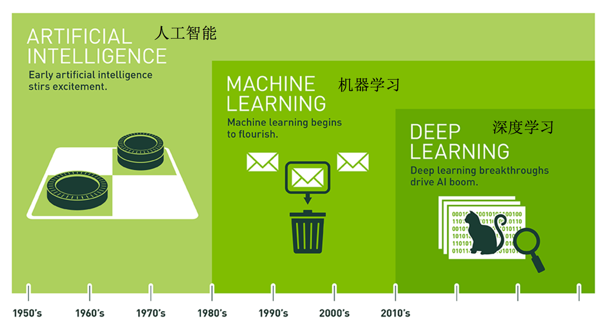
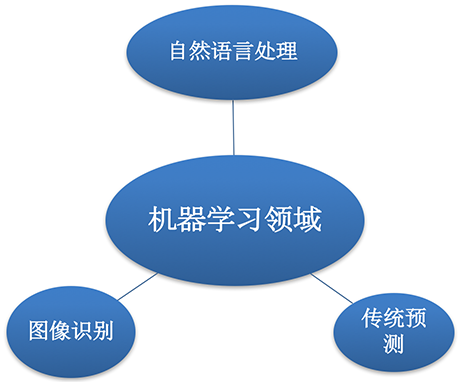

# 1.1. 人工智能概述

1.1.1 机器学习与人工智能、深度学习
--------------------

* 机器学习和人工智能，深度学习的关系

  *   机器学习是人工智能的一个实现途径

  *   深度学习是机器学习的一个方法发展而来

* 达特茅斯会议-人工智能的起点

  1956年8月，在美国汉诺斯小镇宁静的达特茅斯学院中，

  约翰·麦卡锡（John McCarthy）

  马文·闵斯基（Marvin Minsky，人工智能与认知学专家）

  克劳德·香农（Claude Shannon，信息论的创始人）

  艾伦·纽厄尔（Allen Newell，计算机科学家，1975年与赫伯特·西蒙共同获得 图灵奖）

  赫伯特·西蒙（Herbert Simon，诺贝尔经济学奖得主）等科学家正聚在一起，讨论着一个完全不食人间烟火的主题：

  **用机器来模仿人类学习以及其他方面的智能。**

  会议足足开了两个月的时间，虽然大家没有达成普遍的共识，但是却为会议讨论的内容起了一个名字：

  [人工智能](https://baike.baidu.com/item/%E4%BA%BA%E5%B7%A5%E6%99%BA%E8%83%BD)

  因此，1956年也就成为了人工智能元年。

1.1.2 机器学习、深度学习能做些什么
--------------------

**机器学习的应用场景非常多，可以说渗透到了各个行业领域当中。医疗、航空、教育、物流、电商等等领域的各种场景。**

* 用在挖掘、预测领域：

  *   应用场景：店铺销量预测、量化投资、广告推荐、企业客户分类、SQL语句安全检测分类…
* 用在图像领域：

  * 应用场景：街道交通标志检测、人脸识别等等

    

* 用在自然语言处理领域：

  * 应用场景：文本分类、情感分析、自动聊天、文本检测等等

    

**当前重要的是掌握一些机器学习算法等技巧，从某个业务领域切入解决问题。**

1.1.3 人工智能阶段课程安排
----------------

