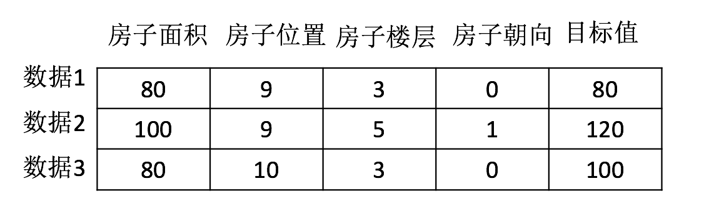

# 1.2. 什么是机器学习

1.2.1 定义
--------

机器学习是从**数据**中**自动分析获得模型**，并利用**模型**对未知数据进行预测。

1.2.2 解释
--------

*   我们人从大量的日常经验中归纳规律，当面临新的问题的时候，就可以利用以往总结的规律去分析现实状况，采取最佳策略。

*   从数据（大量的猫和狗的图片）中自动分析获得模型（辨别猫和狗的规律），从而使机器拥有识别猫和狗的能力。

*   从数据（房屋的各种信息）中自动分析获得模型（判断房屋价格的规律），从而使机器拥有预测房屋价格的能力。

**从历史数据当中获得规律？这些历史数据是怎么的格式？**

1.2.3 数据集构成
-----------

*   结构：特征值+目标值

> 注：
>
> *   对于每一行数据我们可以称之为**样本**。
> *   有些数据集可以没有目标值：

