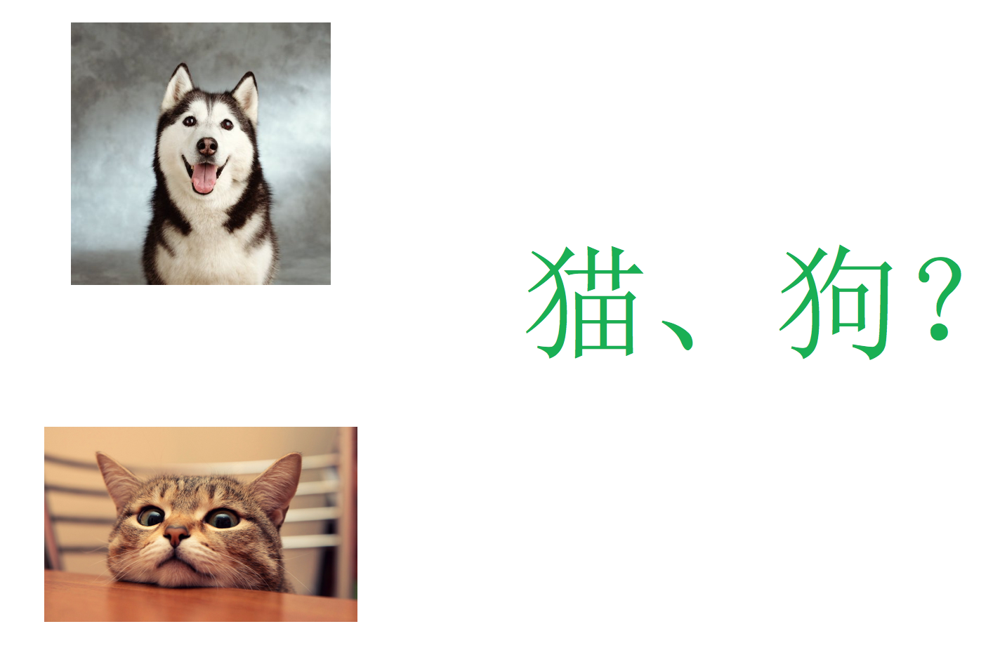

# 1.3. 机器学习算法分类

学习目标
----

*   目标

    *   说明机器学习算法监督学习与无监督学习的区别

    *   说明监督学习中的分类、回归特点

*   应用

    *   无

### 分析1.2中的例子：

*   特征值：猫/狗的图片；目标值：猫/狗-类别
    *   分类问题

* 特征值：房屋的各个属性信息；目标值：房屋价格-连续型数据

  * 回归问题

    

* 特征值：人物的各个属性信息；目标值：无

  *   无监督学习

1.3.1 总结
--------

1.3.2 练习
--------

说一下它们具体问题类别：

1、预测明天的气温是多少度？

2、预测明天是阴、晴还是雨？

3、人脸年龄预测？

4、人脸识别？

1.3.3 机器学习算法分类
--------------

*   **监督学习(supervised learning)（预测）**
    *   定义：输入数据是由输入特征值和目标值所组成。函数的输出可以是一个连续的值(称为回归），或是输出是有限个离散值（称作分类）。
    *   **分类 k-近邻算法、贝叶斯分类、决策树与随机森林、逻辑回归、神经网络**
    *   **回归 线性回归、岭回归**
*   **无监督学习(unsupervised learning)**
    *   定义：输入数据是由输入特征值所组成。
    *   **聚类 k-means**