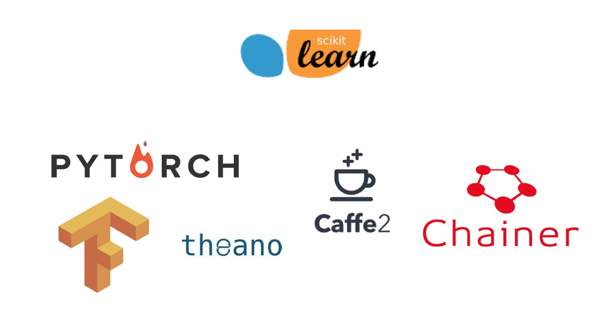
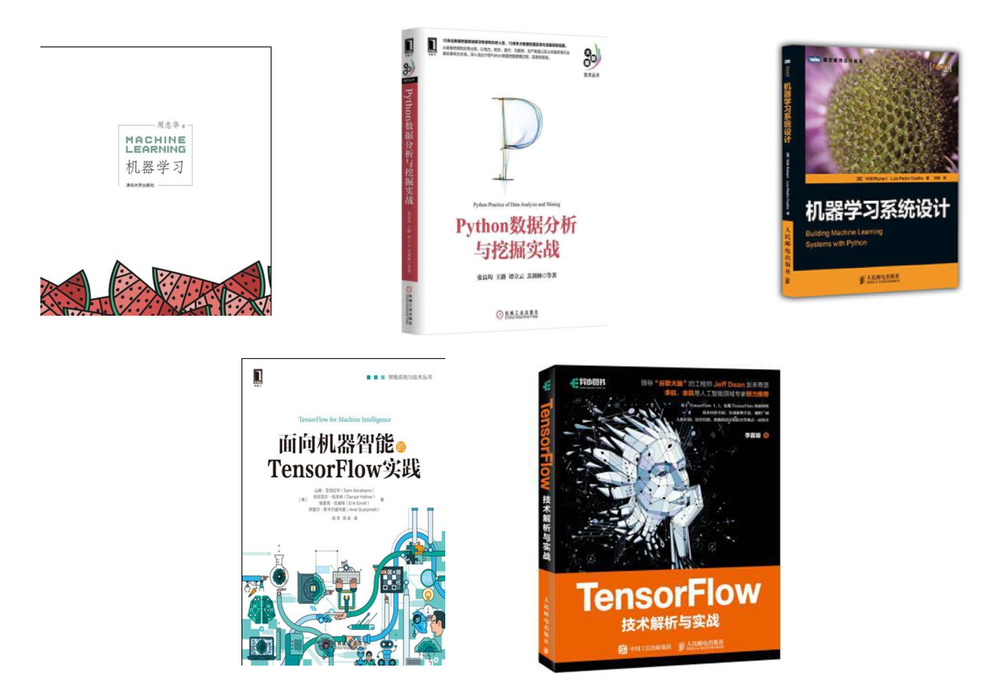

# 1.5. 学习框架和资料介绍

需明确几点问题：

（1）**算法**是核心，**数据**与**计算**是基础

（2）找准定位

大部分复杂模型的算法设计都是算法工程师在做，而我们

*   分析很多的数据
*   分析具体的业务
*   应用常见的算法
*   特征工程、调参数、优化

*   我们应该怎么做？

*   学会分析问题，使用机器学习算法的目的，想要算法完成何种任务

*   掌握算法基本思想，学会对问题用相应的算法解决
*   学会利用库或者框架解决问题

**当前重要的是掌握一些机器学习算法等技巧，从某个业务领域切入解决问题。**

1.5.1 机器学习库与框架
--------------

1.5.2 书籍资料
----------

1.5.3 提深内功（但不是必须）
-----------------

