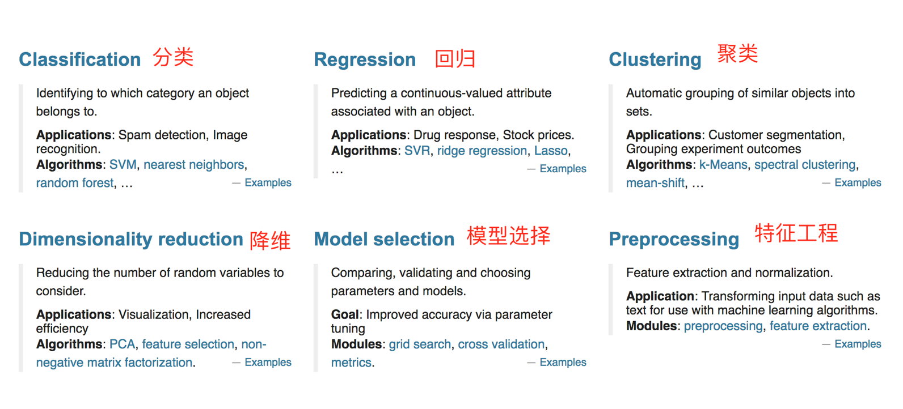

# 2.1. 数据集

*   目标
    *   知道数据集的分为训练集和测试集
    *   会使用sklearn的数据集
*   应用
    *   无

### 2.1.1 可用数据集


Kaggle网址：[https://www.kaggle.com/datasets](https://www.kaggle.com/datasets)

UCI数据集网址： [http://archive.ics.uci.edu/ml/](http://archive.ics.uci.edu/ml/)

scikit-learn网址：[http://scikit-learn.org/stable/datasets/index.html#datasets](http://scikit-learn.org/stable/datasets/index.html)

#### 1 Scikit-learn工具介绍


*   Python语言的机器学习工具
*   Scikit-learn包括许多知名的机器学习算法的实现
*   Scikit-learn文档完善，容易上手，丰富的API
*   目前稳定版本0.19.1

#### 2 安装

    pip3 install Scikit-learn==0.19.1


安装好之后可以通过以下命令查看是否安装成功

    import sklearn


*   注：安装scikit-learn需要Numpy, Scipy等库

#### 3 Scikit-learn包含的内容



*   分类、聚类、回归
*   特征工程
*   模型选择、调优

### 2.1.2 sklearn数据集

#### 1 scikit-learn数据集API介绍

*   sklearn.datasets
    *   加载获取流行数据集
    *   datasets.load_*()
        *   获取小规模数据集，数据包含在datasets里
    *   datasets.fetch_*(data_home=None)
        *   获取大规模数据集，需要从网络上下载，函数的第一个参数是data\_home，表示数据集下载的目录,默认是 ~/scikit\_learn_data/

#### 2 sklearn小数据集

* sklearn.datasets.load_iris()

  加载并返回鸢尾花数据集


* sklearn.datasets.load_boston()

  加载并返回波士顿房价数据集


#### 3 sklearn大数据集

*   sklearn.datasets.fetch\_20newsgroups(data\_home=None,subset=‘train’)
    *   subset：'train'或者'test'，'all'，可选，选择要加载的数据集。
    *   训练集的“训练”，测试集的“测试”，两者的“全部”

#### 4 sklearn数据集的使用

* 以鸢尾花数据集为例：

  


**sklearn数据集返回值介绍**

* load_和fetch_返回的数据类型datasets.base.Bunch(字典格式)
  *   data：特征数据数组，是 \[n\_samples * n\_features\] 的二维 numpy.ndarray 数组
  *   target：标签数组，是 n_samples 的一维 numpy.ndarray 数组
  *   DESCR：数据描述
  *   feature_names：特征名,新闻数据，手写数字、回归数据集没有
  *   target_names：标签名

  from sklearn.datasets import load_iris
  # 获取鸢尾花数据集
  iris = load_iris()
  print("鸢尾花数据集的返回值：\n", iris)
  # 返回值是一个继承自字典的Bench
  print("鸢尾花的特征值:\n", iris["data"])
  print("鸢尾花的目标值：\n", iris.target)
  print("鸢尾花特征的名字：\n", iris.feature_names)
  print("鸢尾花目标值的名字：\n", iris.target_names)
  print("鸢尾花的描述：\n", iris.DESCR)


**思考：拿到的数据是否全部都用来训练一个模型？**

### 2.1.3 数据集的划分

机器学习一般的数据集会划分为两个部分：

*   训练数据：用于训练，**构建模型**
*   测试数据：在模型检验时使用，用于**评估模型是否有效**

划分比例：

*   训练集：70% 80% 75%
*   测试集：30% 20% 25%

**数据集划分api**

* sklearn.model\_selection.train\_test_split(_arrays, *_options)
  *   x 数据集的特征值
  *   y 数据集的标签值
  *   test_size 测试集的大小，一般为float
  *   random_state 随机数种子,不同的种子会造成不同的随机采样结果。相同的种子采样结果相同。
  *   return 测试集特征训练集特征值值，训练标签，测试标签(默认随机取)

  from sklearn.datasets import load_iris
  from sklearn.model_selection import train_test_split


  def datasets_demo():
  ​    """
  ​    对鸢尾花数据集的演示
  ​    :return: None
  ​    """
  ​    # 1、获取鸢尾花数据集
  ​    iris = load_iris()
  ​    print("鸢尾花数据集的返回值：\n", iris)
  ​    # 返回值是一个继承自字典的Bench
  ​    print("鸢尾花的特征值:\n", iris["data"])
  ​    print("鸢尾花的目标值：\n", iris.target)
  ​    print("鸢尾花特征的名字：\n", iris.feature_names)
  ​    print("鸢尾花目标值的名字：\n", iris.target_names)
  ​    print("鸢尾花的描述：\n", iris.DESCR)

  ```python
  # 2、对鸢尾花数据集进行分割
  # 训练集的特征值x_train 测试集的特征值x_test 训练集的目标值y_train 测试集的目标值y_test
  x_train, x_test, y_train, y_test = train_test_split(iris.data, iris.target, random_state=22)
  print("x_train:\n", x_train.shape)
  # 随机数种子
  x_train1, x_test1, y_train1, y_test1 = train_test_split(iris.data, iris.target, random_state=6)
  x_train2, x_test2, y_train2, y_test2 = train_test_split(iris.data, iris.target, random_state=6)
  print("如果随机数种子不一致：\n", x_train == x_train1)
  print("如果随机数种子一致：\n", x_train1 == x_train2)
  
  return None
  ```
