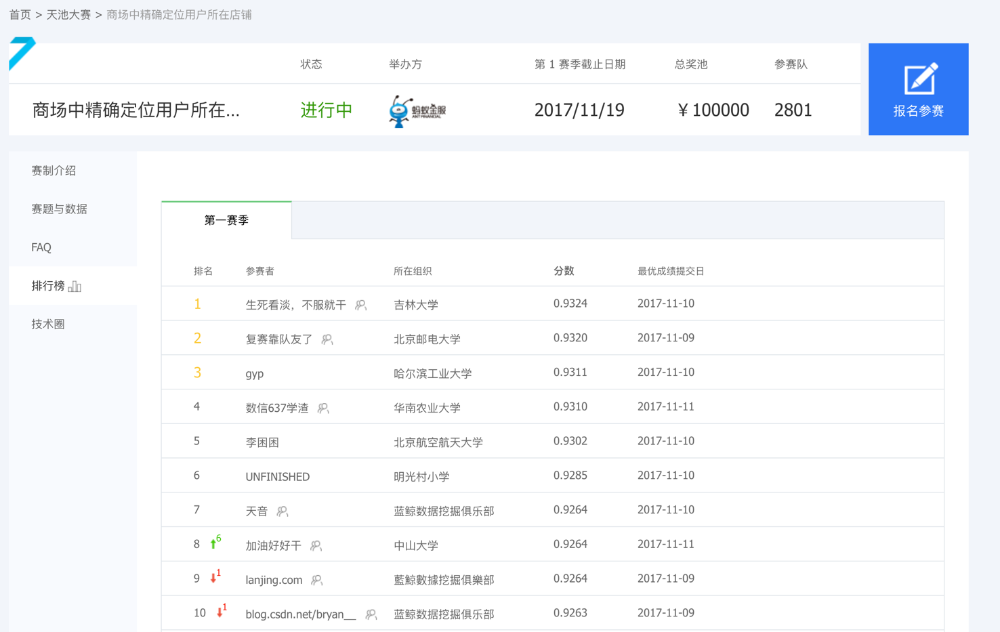

# 2.2. 特征工程介绍

学习目标
----

*   目标
    *   了解特征工程在机器学习当中的重要性
    *   知道特征工程的分类
*   应用
    *   无

2.2.1 为什么需要特征工程(Feature Engineering)
------------------------------------

> 机器学习领域的大神Andrew Ng(吴恩达)老师说“Coming up with features is difficult, time-consuming, requires expert knowledge. “Applied machine learning” is basically feature engineering. ”
>
> 注：业界广泛流传：数据和特征决定了机器学习的上限，而模型和算法只是逼近这个上限而已。

2.2.2 什么是特征工程
-------------

特征工程是使用**专业背景知识和技巧处理数据**，**使得特征能在机器学习算法上发挥更好的作用的过程**。

*   意义：会直接影响机器学习的效果

2.2.3 特征工程的位置与数据处理的比较
---------------------

*   pandas:一个数据读取非常方便以及基本的处理格式的工具
*   sklearn:对于特征的处理提供了强大的接口

**特征工程包含内容**

*   特征抽取
*   特征预处理
*   特征降维