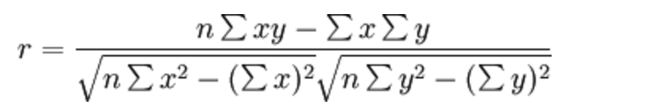

# 2.5. 特征降维

学习目标
----

*   目标
    *   知道特征选择的嵌入式、过滤式以及包裹氏三种方式
    *   应用VarianceThreshold实现删除低方差特征
    *   了解相关系数的特点和计算
    *   应用相关性系数实现特征选择
*   应用
    *   无

2.5.1 降维
--------

**降维**是指在某些限定条件下，**降低随机变量(特征)个数**，得到**一组“不相关”主变量**的过程

*   降低随机变量的个数

*   相关特征(correlated feature)
    *   相对湿度与降雨量之间的相关
    *   等等

> 正是因为在进行训练的时候，我们都是使用特征进行学习。如果特征本身存在问题或者特征之间相关性较强，对于算法学习预测会影响较大

2.5.2 降维的两种方式
-------------

*   **特征选择**
*   **主成分分析（可以理解一种特征提取的方式）**

2.5.3 什么是特征选择
-------------

### 1 定义

数据中包含**冗余或无关变量（或称特征、属性、指标等）**，旨在从**原有特征中找出主要特征**。

### 2 方法

*   **Filter(过滤式)：主要探究特征本身特点、特征与特征和目标值之间关联**
    *   **方差选择法：低方差特征过滤**
    *   **相关系数**
*   **Embedded (嵌入式)：算法自动选择特征（特征与目标值之间的关联）**
    *   **决策树:信息熵、信息增益**
    *   **正则化：L1、L2**
    *   **深度学习：卷积等**

> 对于Embedded方式，只能在讲解算法的时候在进行介绍，更好的去理解

### 3 模块

    sklearn.feature_selection

### 4 过滤式

#### 4.1 低方差特征过滤

删除低方差的一些特征，前面讲过方差的意义。再结合方差的大小来考虑这个方式的角度。

*   特征方差小：某个特征大多样本的值比较相近
*   特征方差大：某个特征很多样本的值都有差别

##### 4.1.1 API

*   sklearn.feature_selection.VarianceThreshold(threshold = 0.0)
    *   删除所有低方差特征
    *   Variance.fit_transform(X)
        *   X:numpy array格式的数据\[n\_samples,n\_features\]
        *   返回值：训练集差异低于threshold的特征将被删除。默认值是保留所有非零方差特征，即删除所有样本中具有相同值的特征。

##### 4.1.2 数据计算

我们对**某些股票的指标特征之间进行一个筛选**，数据在"factor\_regression\_data/factor_returns.csv"文件当中,除去'index,'date','return'列不考虑**（这些类型不匹配，也不是所需要指标）**

一共这些特征

    pe_ratio,pb_ratio,market_cap,return_on_asset_net_profit,du_return_on_equity,ev,earnings_per_share,revenue,total_expense

    index,pe_ratio,pb_ratio,market_cap,return_on_asset_net_profit,du_return_on_equity,ev,earnings_per_share,revenue,total_expense,date,return
    0,000001.XSHE,5.9572,1.1818,85252550922.0,0.8008,14.9403,1211444855670.0,2.01,20701401000.0,10882540000.0,2012-01-31,0.027657228229937388
    1,000002.XSHE,7.0289,1.588,84113358168.0,1.6463,7.8656,300252061695.0,0.326,29308369223.2,23783476901.2,2012-01-31,0.08235182370820669
    2,000008.XSHE,-262.7461,7.0003,517045520.0,-0.5678,-0.5943,770517752.56,-0.006,11679829.03,12030080.04,2012-01-31,0.09978900335112327
    3,000060.XSHE,16.476,3.7146,19680455995.0,5.6036,14.617,28009159184.6,0.35,9189386877.65,7935542726.05,2012-01-31,0.12159482758620697
    4,000069.XSHE,12.5878,2.5616,41727214853.0,2.8729,10.9097,81247380359.0,0.271,8951453490.28,7091397989.13,2012-01-31,-0.0026808154146886697

*   分析

1、初始化VarianceThreshold,指定阀值方差

2、调用fit_transform

    def variance_demo():
        """
        删除低方差特征——特征选择
        :return: None
        """
        data = pd.read_csv("factor_returns.csv")
        print(data)
        # 1、实例化一个转换器类
        transfer = VarianceThreshold(threshold=1)
        # 2、调用fit_transform
        data = transfer.fit_transform(data.iloc[:, 1:10])
        print("删除低方差特征的结果：\n", data)
        print("形状：\n", data.shape)
    
        return None

返回结果：

                index  pe_ratio  pb_ratio    market_cap  \
    0     000001.XSHE    5.9572    1.1818  8.525255e+10   
    1     000002.XSHE    7.0289    1.5880  8.411336e+10    
    ...           ...       ...       ...           ...   
    2316  601958.XSHG   52.5408    2.4646  3.287910e+10   
    2317  601989.XSHG   14.2203    1.4103  5.911086e+10   
    
          return_on_asset_net_profit  du_return_on_equity            ev  \
    0                         0.8008              14.9403  1.211445e+12   
    1                         1.6463               7.8656  3.002521e+11    
    ...                          ...                  ...           ...   
    2316                      2.7444               2.9202  3.883803e+10   
    2317                      2.0383               8.6179  2.020661e+11   
    
          earnings_per_share       revenue  total_expense        date    return  
    0                 2.0100  2.070140e+10   1.088254e+10  2012-01-31  0.027657  
    1                 0.3260  2.930837e+10   2.378348e+10  2012-01-31  0.082352  
    2                -0.0060  1.167983e+07   1.203008e+07  2012-01-31  0.099789   
    ...                  ...           ...            ...         ...       ...  
    2315              0.2200  1.789082e+10   1.749295e+10  2012-11-30  0.137134  
    2316              0.1210  6.465392e+09   6.009007e+09  2012-11-30  0.149167  
    2317              0.2470  4.509872e+10   4.132842e+10  2012-11-30  0.183629  
    
    [2318 rows x 12 columns]
    删除低方差特征的结果：
     [[  5.95720000e+00   1.18180000e+00   8.52525509e+10 ...,   1.21144486e+12
        2.07014010e+10   1.08825400e+10]
     [  7.02890000e+00   1.58800000e+00   8.41133582e+10 ...,   3.00252062e+11
        2.93083692e+10   2.37834769e+10]
     [ -2.62746100e+02   7.00030000e+00   5.17045520e+08 ...,   7.70517753e+08
        1.16798290e+07   1.20300800e+07]
     ..., 
     [  3.95523000e+01   4.00520000e+00   1.70243430e+10 ...,   2.42081699e+10
        1.78908166e+10   1.74929478e+10]
     [  5.25408000e+01   2.46460000e+00   3.28790988e+10 ...,   3.88380258e+10
        6.46539204e+09   6.00900728e+09]
     [  1.42203000e+01   1.41030000e+00   5.91108572e+10 ...,   2.02066110e+11
        4.50987171e+10   4.13284212e+10]]
    形状：
     (2318, 8)

#### 4.2 相关系数

*   皮尔逊相关系数(Pearson Correlation Coefficient)
    *   反映变量之间相关关系密切程度的统计指标

##### 4.2.2 公式计算案例(了解，不用记忆)

*   公式

*   比如说我们计算年广告费投入与月均销售额

那么之间的相关系数怎么计算

最终计算：

= 0.9942

**所以我们最终得出结论是广告投入费与月平均销售额之间有高度的正相关关系。** 　　

##### 4.2.3 特点

**相关系数的值介于–1与+1之间，即–1≤ r ≤+1**。其性质如下：

*   **当r>0时，表示两变量正相关，r<0时，两变量为负相关**
*   当|r|=1时，表示两变量为完全相关，当r=0时，表示两变量间无相关关系
*   **当0<|r|<1时，表示两变量存在一定程度的相关。且|r|越接近1，两变量间线性关系越密切；|r|越接近于0，表示两变量的线性相关越弱**
*   **一般可按三级划分：|r|<0.4为低度相关；0.4≤|r|<0.7为显著性相关；0.7≤|r|<1为高度线性相关**

> 这个符号：|r|为r的绝对值， |-5| = 5

##### 4.2.4 API

*   from scipy.stats import pearsonr
    *   x : (N,) array_like
    *   y : (N,) array_like Returns: (Pearson’s correlation coefficient, p-value)

##### 4.2.5 案例：股票的财务指标相关性计算

我们刚才的股票的这些指标进行相关性计算， 假设我们以

    factor = ['pe_ratio','pb_ratio','market_cap','return_on_asset_net_profit','du_return_on_equity','ev','earnings_per_share','revenue','total_expense']

这些特征当中的两两进行计算，得出相关性高的一些特征

* 分析
  *   两两特征之间进行相关性计算

  import pandas as pd
  from scipy.stats import pearsonr

  def pearsonr_demo():
  ​    """
  ​    相关系数计算
  ​    :return: None
  ​    """
  ​    data = pd.read_csv("factor_returns.csv")

      factor = ['pe_ratio', 'pb_ratio', 'market_cap', 'return_on_asset_net_profit', 'du_return_on_equity', 'ev',
                'earnings_per_share', 'revenue', 'total_expense']
      
      for i in range(len(factor)):
          for j in range(i, len(factor) - 1):
              print(
                  "指标%s与指标%s之间的相关性大小为%f" % (factor[i], factor[j + 1], pearsonr(data[factor[i]], data[factor[j + 1]])[0]))
      
      return None

返回结果：

    指标pe_ratio与指标pb_ratio之间的相关性大小为-0.004389
    指标pe_ratio与指标market_cap之间的相关性大小为-0.068861
    指标pe_ratio与指标return_on_asset_net_profit之间的相关性大小为-0.066009
    指标pe_ratio与指标du_return_on_equity之间的相关性大小为-0.082364
    指标pe_ratio与指标ev之间的相关性大小为-0.046159
    指标pe_ratio与指标earnings_per_share之间的相关性大小为-0.072082
    指标pe_ratio与指标revenue之间的相关性大小为-0.058693
    指标pe_ratio与指标total_expense之间的相关性大小为-0.055551
    指标pb_ratio与指标market_cap之间的相关性大小为0.009336
    指标pb_ratio与指标return_on_asset_net_profit之间的相关性大小为0.445381
    指标pb_ratio与指标du_return_on_equity之间的相关性大小为0.291367
    指标pb_ratio与指标ev之间的相关性大小为-0.183232
    指标pb_ratio与指标earnings_per_share之间的相关性大小为0.198708
    指标pb_ratio与指标revenue之间的相关性大小为-0.177671
    指标pb_ratio与指标total_expense之间的相关性大小为-0.173339
    指标market_cap与指标return_on_asset_net_profit之间的相关性大小为0.214774
    指标market_cap与指标du_return_on_equity之间的相关性大小为0.316288
    指标market_cap与指标ev之间的相关性大小为0.565533
    指标market_cap与指标earnings_per_share之间的相关性大小为0.524179
    指标market_cap与指标revenue之间的相关性大小为0.440653
    指标market_cap与指标total_expense之间的相关性大小为0.386550
    指标return_on_asset_net_profit与指标du_return_on_equity之间的相关性大小为0.818697
    指标return_on_asset_net_profit与指标ev之间的相关性大小为-0.101225
    指标return_on_asset_net_profit与指标earnings_per_share之间的相关性大小为0.635933
    指标return_on_asset_net_profit与指标revenue之间的相关性大小为0.038582
    指标return_on_asset_net_profit与指标total_expense之间的相关性大小为0.027014
    指标du_return_on_equity与指标ev之间的相关性大小为0.118807
    指标du_return_on_equity与指标earnings_per_share之间的相关性大小为0.651996
    指标du_return_on_equity与指标revenue之间的相关性大小为0.163214
    指标du_return_on_equity与指标total_expense之间的相关性大小为0.135412
    指标ev与指标earnings_per_share之间的相关性大小为0.196033
    指标ev与指标revenue之间的相关性大小为0.224363
    指标ev与指标total_expense之间的相关性大小为0.149857
    指标earnings_per_share与指标revenue之间的相关性大小为0.141473
    指标earnings_per_share与指标total_expense之间的相关性大小为0.105022
    指标revenue与指标total_expense之间的相关性大小为0.995845

从中我们得出

*   指标revenue与指标total_expense之间的相关性大小为0.995845
*   指标return\_on\_asset\_net\_profit与指标du\_return\_on_equity之间的相关性大小为0.818697

我们也可以通过画图来观察结果

    import matplotlib.pyplot as plt
    plt.figure(figsize=(20, 8), dpi=100)
    plt.scatter(data['revenue'], data['total_expense'])
    plt.show()

**这两对指标之间的相关性较大，可以做之后的处理，比如合成这两个指标。**