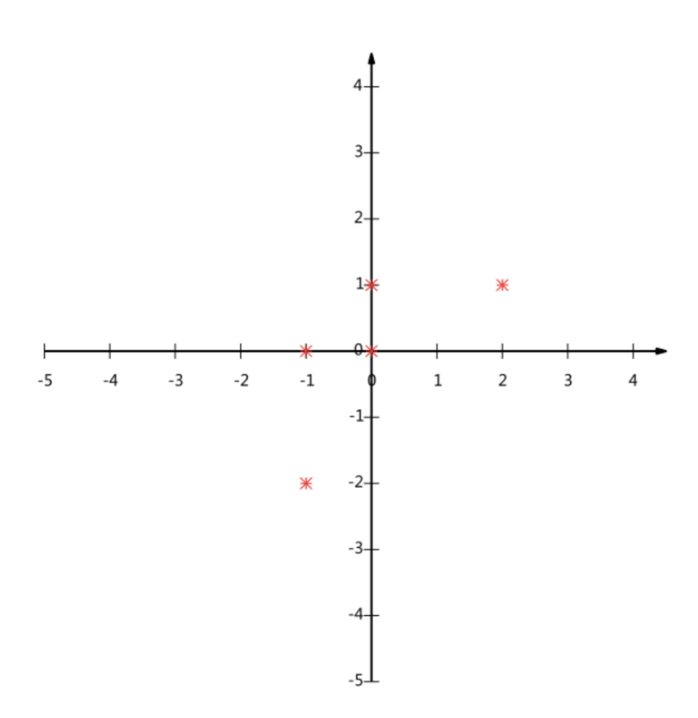
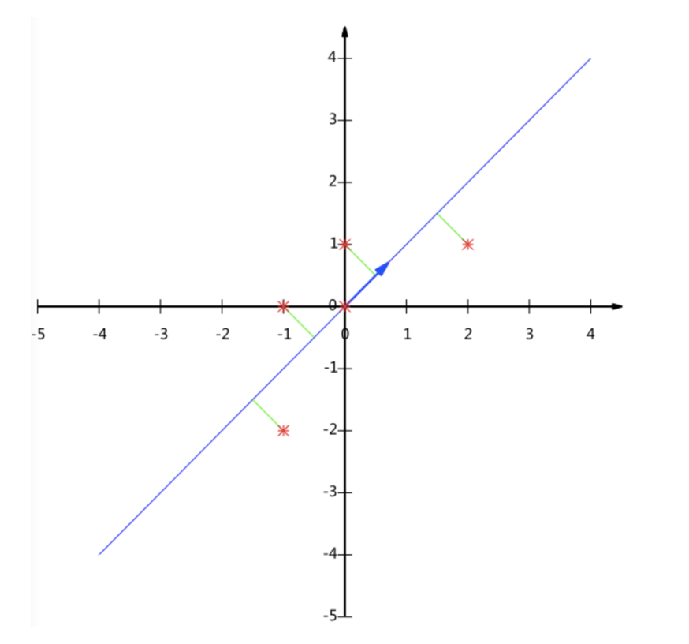

# 2.6. 主成分分析

学习目标
----

*   目标
    *   应用PCA实现特征的降维
*   应用
    *   用户与物品类别之间主成分分析

2.6.1 什么是主成分分析(PCA)
-------------------

*   定义：**高维数据转化为低维数据的过程**，在此过程中**可能会舍弃原有数据、创造新的变量**

*   作用：**是数据维数压缩，尽可能降低原数据的维数（复杂度），损失少量信息。**

*   应用：回归分析或者聚类分析当中

> 对于信息一词，在决策树中会进行介绍

那么更好的理解这个过程呢？我们来看一张图

### 1 计算案例理解(了解，无需记忆)

假设对于给定5个点，数据如下

    (-1,-2)
    (-1, 0)
    ( 0, 0)
    ( 2, 1)
    ( 0, 1)

要求：将这个二维的数据简化成一维？ 并且损失少量的信息

这个过程如何计算的呢？**找到一个合适的直线，通过一个矩阵运算得出主成分分析的结果（不需要理解）**

### 2 API

*   sklearn.decomposition.PCA(n_components=None)
    *   将数据分解为较低维数空间
    *   n_components:
        *   **小数：表示保留百分之多少的信息**
        *   **整数：减少到多少特征**
    *   PCA.fit\_transform(X) X:numpy array格式的数据\[n\_samples,n_features\]
    *   返回值：转换后指定维度的array

### 3 数据计算

先拿个简单的数据计算一下

    [[2,8,4,5],
    [6,3,0,8],
    [5,4,9,1]]

    from sklearn.decomposition import PCA
    
    def pca_demo():
        """
        对数据进行PCA降维
        :return: None
        """
        data = [[2,8,4,5], [6,3,0,8], [5,4,9,1]]
    
        # 1、实例化PCA, 小数——保留多少信息
        transfer = PCA(n_components=0.9)
        # 2、调用fit_transform
        data1 = transfer.fit_transform(data)
    
        print("保留90%的信息，降维结果为：\n", data1)
    
        # 1、实例化PCA, 整数——指定降维到的维数
        transfer2 = PCA(n_components=3)
        # 2、调用fit_transform
        data2 = transfer2.fit_transform(data)
        print("降维到3维的结果：\n", data2)
    
        return None

返回结果：

    保留90%的信息，降维结果为：
     [[ -3.13587302e-16   3.82970843e+00]
     [ -5.74456265e+00  -1.91485422e+00]
     [  5.74456265e+00  -1.91485422e+00]]
    降维到3维的结果：
     [[ -3.13587302e-16   3.82970843e+00   4.59544715e-16]
     [ -5.74456265e+00  -1.91485422e+00   4.59544715e-16]
     [  5.74456265e+00  -1.91485422e+00   4.59544715e-16]]

2.6.2 案例：探究用户对物品类别的喜好细分降维
-------------------------

[https://www.kaggle.com/c/instacart-market-basket-analysis](https://www.kaggle.com/c/instacart-market-basket-analysis)

数据如下：

*   order\_products\_\_prior.csv：订单与商品信息

    *   字段：**order_id**, **product_id**, add\_to\_cart_order, reordered
*   products.csv：商品信息

    *   字段：**product_id**, product_name, **aisle_id**, department_id
*   orders.csv：用户的订单信息
    *   字段：**order_id**,**user_id**,eval\_set,order\_number,….
*   aisles.csv：商品所属具体物品类别
    *   字段： **aisle_id**, **aisle**

### 1 需求

### 2 分析

*   合并表，使得**user_id**与**aisle**在一张表当中
*   进行交叉表变换
*   进行降维

### 3 完整代码

    import pandas as pd
    from sklearn.decomposition import PCA
    
    # 1、获取数据集
    # ·商品信息- products.csv：
    # Fields：product_id, product_name, aisle_id, department_id
    # ·订单与商品信息- order_products__prior.csv：
    # Fields：order_id, product_id, add_to_cart_order, reordered 
    # ·用户的订单信息- orders.csv：
    # Fields：order_id, user_id,eval_set, order_number,order_dow, order_hour_of_day, days_since_prior_order 
    # ·商品所属具体物品类别- aisles.csv：
    # Fields：aisle_id, aisle     
    products = pd.read_csv("./instacart/products.csv")
    order_products = pd.read_csv("./instacart/order_products__prior.csv")
    orders = pd.read_csv("./instacart/orders.csv")
    aisles = pd.read_csv("./instacart/aisles.csv")
    
    # 2、合并表，将user_id和aisle放在一张表上
    # 1）合并orders和order_products on=order_id tab1:order_id, product_id, user_id
    tab1 = pd.merge(orders, order_products, on=["order_id", "order_id"])
    # 2）合并tab1和products on=product_id tab2:aisle_id
    tab2 = pd.merge(tab1, products, on=["product_id", "product_id"])
    # 3）合并tab2和aisles on=aisle_id tab3:user_id, aisle
    tab3 = pd.merge(tab2, aisles, on=["aisle_id", "aisle_id"])
    
    # 3、交叉表处理，把user_id和aisle进行分组
    table = pd.crosstab(tab3["user_id"], tab3["aisle"])
    
    # 4、主成分分析的方法进行降维
    # 1）实例化一个转换器类PCA
    transfer = PCA(n_components=0.95)
    # 2）fit_transform
    data = transfer.fit_transform(table)
    
    data.shape

返回结果：

    (206209, 44)
