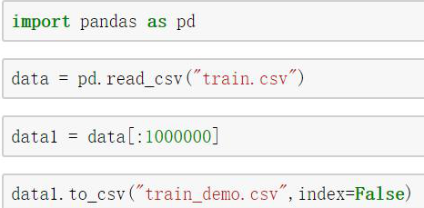
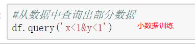

# 3.1. sklearn转换器和估计器

学习目标
----

*   目标
    *   知道sklearn的转换器和估计器流程
*   应用
    *   无
*   内容预览
    *   3.1.1 转换器
    *   3.1.2 估计器(sklearn机器学习算法的实现)

3.1.1 转换器
---------

想一下之前做的特征工程的步骤？

*   1 实例化 (实例化的是一个转换器类(Transformer))
*   2 调用fit_transform(对于文档建立分类词频矩阵，不能同时调用)

我们把特征工程的接口称之为转换器，其中转换器调用有这么几种形式

*   fit_transform
*   fit(**构建规则**)
*   transform(**根据规则转换**)

**这几个方法之间的区别是什么呢？我们看以下代码就清楚了**

    In [1]: from sklearn.preprocessing import StandardScaler
    
    In [2]: std1 = StandardScaler()
    
    In [3]: a = [[1,2,3], [4,5,6]]
    
    In [4]: std1.fit_transform(a)
    Out[4]:
    array([[-1., -1., -1.],
           [ 1.,  1.,  1.]])
    
    In [5]: std2 = StandardScaler()
    
    In [6]: std2.fit(a)
    Out[6]: StandardScaler(copy=True, with_mean=True, with_std=True)
    
    In [7]: std2.transform(a)
    Out[7]:
    array([[-1., -1., -1.],
           [ 1.,  1.,  1.]])

从中可以看出，fit_transform的作用相当于transform加上fit。但是为什么还要提供单独的fit呢, 我们还是使用原来的std2来进行标准化看看

    In [8]: b = [[7,8,9], [10, 11, 12]]
    
    In [9]: std2.transform(b)
    Out[9]:
    array([[3., 3., 3.],
           [5., 5., 5.]])
    
    In [10]: std2.fit_transform(b)
    Out[10]:
    array([[-1., -1., -1.],
           [ 1.,  1.,  1.]])

3.1.2 估计器(sklearn机器学习算法的实现)
---------------------------

在sklearn中，估计器(estimator)是一个重要的角色，是一类实现了算法的API

*   1 用于分类的估计器：
    *   sklearn.neighbors k-近邻算法
    *   sklearn.naive_bayes 贝叶斯
    *   sklearn.linear_model.LogisticRegression 逻辑回归
    *   sklearn.tree 决策树与随机森林
*   2 用于回归的估计器：
    *   sklearn.linear_model.LinearRegression 线性回归
    *   sklearn.linear_model.Ridge 岭回归
*   3 用于无监督学习的估计器
    *   sklearn.cluster.KMeans 聚类

估计器工作流程

------

用数据去'**喂养**'模型, 模型越来越精确

读取csv加载到内存里

你听懂了,跟你能描述出来,能复现一遍是有很大的差距的

k近邻算法什么也没有干,不需要**拟合**,

小数据训练

时间戳!

**兜来转去,兜来转去,兜来转去,你会发现还是那几个工具好用**(好用的工具永远都好用,不会随着时间变坏)

得失不平衡,那样的人我们不关心他

