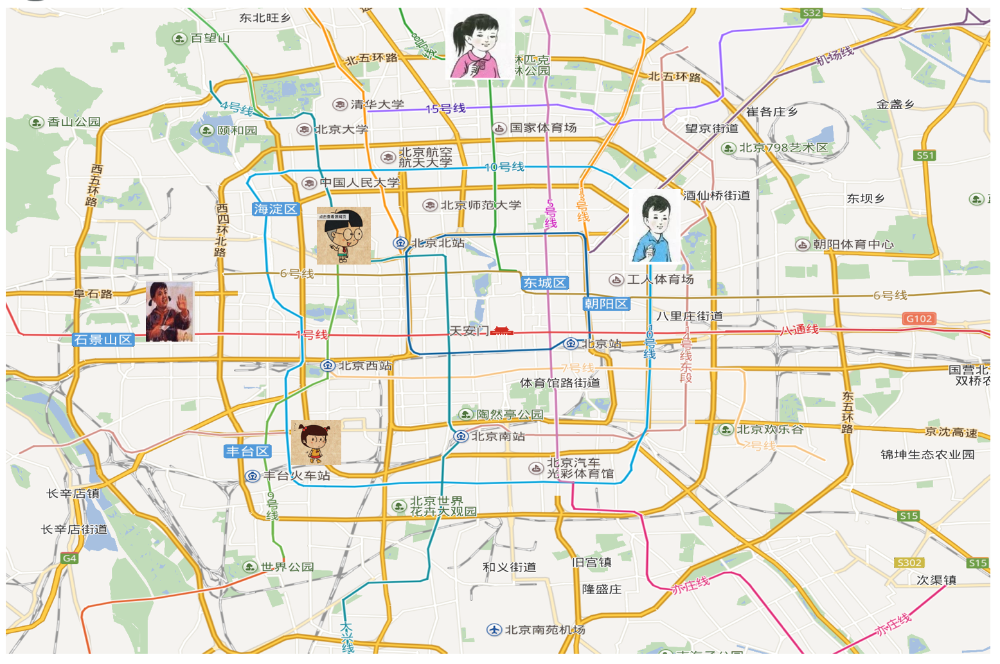
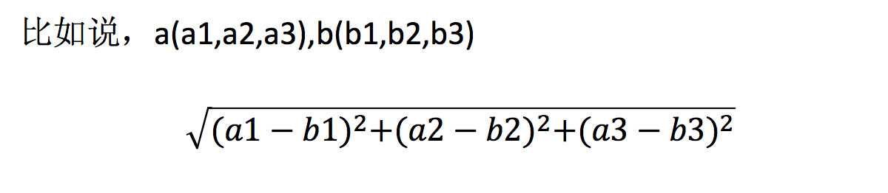
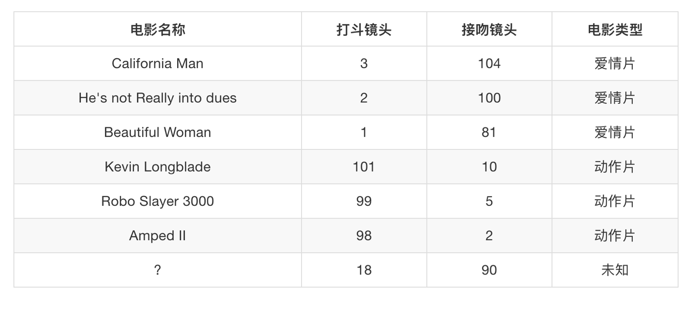
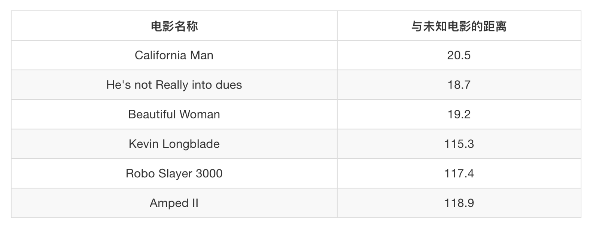
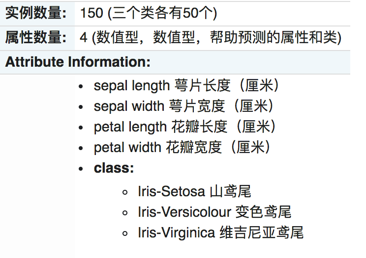
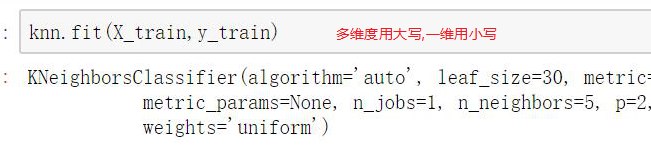

# 3.2. K-近邻算法

学习目标
----

*   目标

    *   说明K-近邻算法的距离公式
    *   说明K-近邻算法的超参数K值以及取值问题
    *   说明K-近邻算法的优缺点
    *   应用KNeighborsClassifier实现分类
    *   了解分类算法的评估标准准确率
*   应用

    *   鸢尾花数据集预测
    *   Facebook签到位置预测
*   内容预览

    *   3.2.1 什么是K-近邻算法
    *   3.2.2 K-近邻算法API
    *   3.2.3 案例：鸢尾花种类预测
    *   3.2.4 K-近邻总结

3.2.1 什么是K-近邻算法
---------------

*   你的“邻居”来推断出你的类别

### 1 K-近邻算法(KNN)原理

K Nearest Neighbor算法又叫KNN算法，这个算法是机器学习里面一个比较经典的算法， 总体来说KNN算法是相对比较容易理解的算法

*   定义

如果一个样本在特征空间中的**k个最相似(即特征空间中最邻近)的样本中的大多数属于某一个类别**，则该样本也属于这个类别。

> 来源：KNN算法最早是由Cover和Hart提出的一种分类算法

*   距离公式

两个样本的距离可以通过如下公式计算，又叫欧式距离

### 2 电影类型分析

假设我们有现在几部电影

其中？ 号电影不知道类别，如何去预测？我们可以利用K近邻算法的思想

### 3 问题

*   如果取的最近的电影数量不一样？会是什么结果？

*   结合前面的约会对象数据，分析K-近邻算法需要做什么样的处理

3.2.2 K-近邻算法API
---------------

*   sklearn.neighbors.KNeighborsClassifier(n_neighbors=5,algorithm='auto')
    *   n\_neighbors：int,可选（默认= 5），k\_neighbors查询默认使用的邻居数
    *   algorithm：{‘auto’，‘ball\_tree’，‘kd\_tree’，‘brute’}，可选用于计算最近邻居的算法：‘ball\_tree’将会使用 BallTree，‘kd\_tree’将使用 KDTree。‘auto’将尝试根据传递给fit方法的值来决定最合适的算法。 (不同实现方式影响效率)

3.2.3 案例1：鸢尾花种类预测
-----------------

### 1 数据集介绍

Iris数据集是常用的分类实验数据集，由Fisher, 1936收集整理。Iris也称鸢尾花卉数据集，是一类多重变量分析的数据集。关于数据集的具体介绍：

### 2 步骤分析

*   获取数据集与分割数据集
*   特征工程：标准化
*   模型训练评估

### 3 代码过程

* 导入模块

  from sklearn.datasets import load_iris
  from sklearn.model_selection import train_test_split
  from sklearn.preprocessing import StandardScaler
  from sklearn.neighbors import KNeighborsClassifier

* 先从sklearn当中获取数据集，然后进行数据集的分割

  # 加载模块
  iris = load_iris()

  # x_train,x_test,y_train,y_test为训练集特征值、测试集特征值、训练集目标值、测试集目标值
  x_train, x_test, y_train, y_test = train_test_split(iris.data, iris.target, test_size=0.2, random_state=22)

* 进行数据标准化
  *   特征值的标准化

  # 3、特征工程：标准化
  transfer = StandardScaler()
  x_train = transfer.fit_transform(x_train)
  x_test = transfer.transform(x_test)

* 模型进行训练预测

  # 实例化API
  estimator = KNeighborsClassifier(n_neighbors=9)
  estimator.fit(x_train, y_train)
  # 5、模型评估
  # 方法1：比对真实值和预测值
  y_predict = estimator.predict(x_test)
  print("预测结果为:\n", y_predict)
  print("比对真实值和预测值：\n", y_predict == y_test)
  # 方法2：直接计算准确率
  score = estimator.score(x_test, y_test)
  print("准确率为：\n", score)

### 4 结果分析

*   1 k值取多大？有什么影响？

k值取很小：容易受到异常点的影响

k值取很大：受到样本均衡的问题

*   2 性能问题？

距离计算上面，时间复杂度高

3.2.4 K-近邻总结
------------

*   优点：
    *   简单，易于理解，易于实现，无需训练
*   缺点：
    *   懒惰算法，对测试样本分类时的计算量大，内存开销大
    *   必须指定K值，K值选择不当则分类精度不能保证
*   使用场景：小数据场景，几千～几万样本，具体场景具体业务去测试

------

笔记:

1. 如果k的距离确定了, 里面的类别不只一个,可以采用最大投票法来确定
2. 穷举法,说白了就是一个一个去试
3. 

1 获取数据

划分数据集

2特征工程,一般对特征用标准化, 不用归一化

预测签到位置:facebook提出的虚拟数据集

