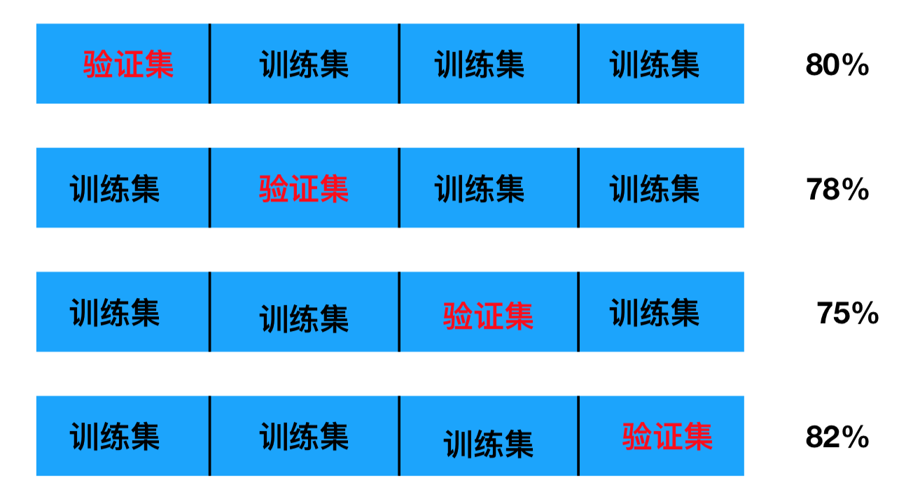
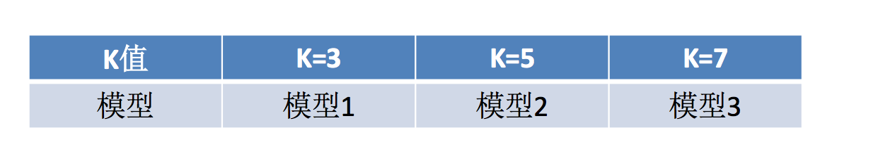

# 3.3. 模型选择与调优

学习目标
----

*   目标
    *   说明交叉验证过程
    *   说明超参数搜索过程
    *   应用GridSearchCV实现算法参数的调优
*   应用
    *   Facebook签到位置预测调优
*   内容预览
    *   3.3.1 什么是交叉验证(cross validation)
    *   3.3.2 超参数搜索-网格搜索(Grid Search)
    *   3.3.3 鸢尾花案例增加K值调优
    *   3.2.4 案例：预测facebook签到位置
    *   3.3.5 总结

3.3.1 什么是交叉验证(cross validation)
-------------------------------

交叉验证：将拿到的训练数据，分为训练和验证集。以下图为例：将数据分成5份，其中一份作为验证集。然后经过5次(组)的测试，每次都更换不同的验证集。即得到5组模型的结果，取平均值作为最终结果。又称5折交叉验证。

### 1 分析

我们之前知道数据分为训练集和测试集，但是**为了让从训练得到模型结果更加准确。**做以下处理

*   训练集：训练集+验证集
*   测试集：测试集

### 2 为什么需要交叉验证

交叉验证目的：**为了让被评估的模型更加准确可信**

#### 问题：那么这个只是对于参数得出更好的结果，那么怎么选择或者调优参数呢？

3.3.2 超参数搜索-网格搜索(Grid Search)
-----------------------------

通常情况下，**有很多参数是需要手动指定的（如k-近邻算法中的K值），这种叫超参数**。但是手动过程繁杂，所以需要对模型预设几种超参数组合。**每组超参数都采用交叉验证来进行评估。最后选出最优参数组合建立模型。**

### 模型选择与调优API

*   sklearn.model\_selection.GridSearchCV(estimator, param\_grid=None,cv=None)
    *   对估计器的指定参数值进行详尽搜索
    *   estimator：估计器对象
    *   param\_grid：估计器参数(dict){“n\_neighbors”:\[1,3,5\]}
    *   cv：指定几折交叉验证

    *   fit：输入训练数据
    *   score：准确率
    *   结果分析：
        *   best_score_:在交叉验证中验证的最好结果_
        *   best_estimator_：最好的参数模型
        *   cv_results_:每次交叉验证后的验证集准确率结果和训练集准确率结果

3.3.3 鸢尾花案例增加K值调优
-----------------

* 使用GridSearchCV构建估计器

  # 1、获取数据集
  iris = load_iris()
  # 2、划分数据集
  x_train, x_test, y_train, y_test = train_test_split(iris.data, iris.target, random_state=22)
  # 3、特征工程：标准化
  # 实例化一个转换器类
  transfer = StandardScaler()
  # 调用fit_transform
  x_train = transfer.fit_transform(x_train)
  x_test = transfer.transform(x_test)
  # 4、KNN预估器流程
  #     1）实例化预估器类
  estimator = KNeighborsClassifier()

  # 5、模型选择与调优——网格搜索和交叉验证
  # 准备要调的超参数
  param_dict = {"n_neighbors": [1, 3, 5]}
  estimator = GridSearchCV(estimator, param_grid=param_dict, cv=3)
  #     2）fit数据进行训练
  estimator.fit(x_train, y_train)
  # 5、评估模型效果
  # 方法a：比对预测结果和真实值
  y_predict = estimator.predict(x_test)
  print("比对预测结果和真实值：\n", y_predict == y_test)
  # 方法b：直接计算准确率
  score = estimator.score(x_test, y_test)
  print("直接计算准确率：\n", score)

* 然后进行评估查看最终选择的结果和交叉验证的结果

  print("在交叉验证中验证的最好结果：\n", estimator.best_score_)
  print("最好的参数模型：\n", estimator.best_estimator_)
  print("每次交叉验证后的准确率结果：\n", estimator.cv_results_)

* 最终结果

  比对预测结果和真实值：
   [ True  True  True  True  True  True  True False  True  True  True  True
    True  True  True  True  True  True False  True  True  True  True  True
    True  True  True  True  True  True  True  True  True  True  True  True
    True  True]
  直接计算准确率：
   0.947368421053
  在交叉验证中验证的最好结果：
   0.973214285714
  最好的参数模型：
   KNeighborsClassifier(algorithm='auto', leaf_size=30, metric='minkowski',
  ​           metric_params=None, n_jobs=1, n_neighbors=5, p=2,
  ​           weights='uniform')
  每次交叉验证后的准确率结果：
   {'mean_fit_time': array([ 0.00114751,  0.00027037,  0.00024462]), 'std_fit_time': array([  1.13901511e-03,   1.25300249e-05,   1.11011951e-05]), 'mean_score_time': array([ 0.00085751,  0.00048693,  0.00045625]), 'std_score_time': array([  3.52785082e-04,   2.87650037e-05,   5.29673344e-06]), 'param_n_neighbors': masked_array(data = [1 3 5],
  ​             mask = [False False False],
  ​       fill_value = ?)
  , 'params': [{'n_neighbors': 1}, {'n_neighbors': 3}, {'n_neighbors': 5}], 'split0_test_score': array([ 0.97368421,  0.97368421,  0.97368421]), 'split1_test_score': array([ 0.97297297,  0.97297297,  0.97297297]), 'split2_test_score': array([ 0.94594595,  0.89189189,  0.97297297]), 'mean_test_score': array([ 0.96428571,  0.94642857,  0.97321429]), 'std_test_score': array([ 0.01288472,  0.03830641,  0.00033675]), 'rank_test_score': array([2, 3, 1], dtype=int32), 'split0_train_score': array([ 1.        ,  0.95945946,  0.97297297]), 'split1_train_score': array([ 1.        ,  0.96      ,  0.97333333]), 'split2_train_score': array([ 1.  ,  0.96,  0.96]), 'mean_train_score': array([ 1.        ,  0.95981982,  0.96876877]), 'std_train_score': array([ 0.        ,  0.00025481,  0.0062022 ])}

3.2.4 案例：预测facebook签到位置
-----------------------

### 1 数据集介绍

数据介绍：将根据用户的位置，准确性和时间戳预测用户正在查看的业务。

    train.csv，test.csv 
    row_id：登记事件的ID
    xy：坐标
    准确性：定位准确性 
    时间：时间戳
    place_id：业务的ID，这是您预测的目标

> 官网：[https://www.kaggle.com/navoshta/grid-knn/data](https://www.kaggle.com/navoshta/grid-knn/data)

### 2 步骤分析

* 对于数据做一些基本处理（这里所做的一些处理不一定达到很好的效果，我们只是简单尝试，有些特征我们可以根据一些特征选择的方式去做处理）

  * 1 缩小数据集范围 DataFrame.query()

  * 2 选取有用的时间特征

  * 3 将签到位置少于n个用户的删除

    place\_count = data.groupby('place\_id').count()

    tf = place\_count\[place\_count.row\_id > 3\].reset\_index()

    data = data\[data\['place\_id'\].isin(tf.place\_id)\]

* 分割数据集

* 标准化处理

* k-近邻预测

### 3 代码过程

* 获取数据集

  # 1、获取数据集
  facebook = pd.read_csv("./FBlocation/train.csv")

* 缩小数据的范围、选择有用的时间特征和取出标签较少的地点

  # 2、基本的数据处理，拿到特征值和目标值
  # 1）缩小数据范围
  facebook = facebook.query("x > 1.0 & x <1.25 & y > 2.0 & y < 2.25")
  # 2）选取有用的时间特征
  time_value = pd.to_datetime(facebook["time"], unit="s")
  time_value = pd.DatetimeIndex(time_value)
  facebook["day"] = time_value.day
  facebook["hour"] = time_value.hour
  facebook["weekday"] = time_value.weekday
  # 3）去掉签到较少的地点
  place_count = facebook.groupby("place_id").count()
  place_count = place_count[place_count["row_id"] > 3]
  facebook = facebook[facebook["place_id"].isin(place_count.index)]

* 取出数据的特征值和目标值

  # 4）拿到特征值x和目标值y
  x = facebook[["x", "y", "accuracy", "day", "hour", "weekday"]]
  y = facebook["place_id"]

* 划分成训练集合测试集

  # 3、数据集的划分
  x_train, x_test, y_train, y_test = train_test_split(x, y, random_state=6)

* 标准化处理

  # 4、特征工程：标准化
  transfer = StandardScaler()
  x_train = transfer.fit_transform(x_train)
  x_test = transfer.transform(x_test)

* K近邻算法模型进行预测

  # 5、KNN预估器流程
  estimator = KNeighborsClassifier()
  # 6、模型评估
  # 方法1：比对真实值和预测值
  y_predict = estimator.predict(x_test)
  print("预测结果为:\n", y_predict)
  print("比对真实值和预测值：\n", y_predict == y_test)
  # 方法2：直接计算准确率
  score = estimator.score(x_test, y_test)
  print("准确率为：\n", score)
  # 7、交叉验证和网格搜索的结果
  print("在交叉验证中验证的最好结果:\n", estimator.best_score_)
  print("最好的参数模型:\n", estimator.best_estimator_)
  print("每次交叉验证后的准确率结果:\n", estimator.cv_results_)

3.3.5 总结
--------

*   交叉验证与网格搜索进行模型参数的选择