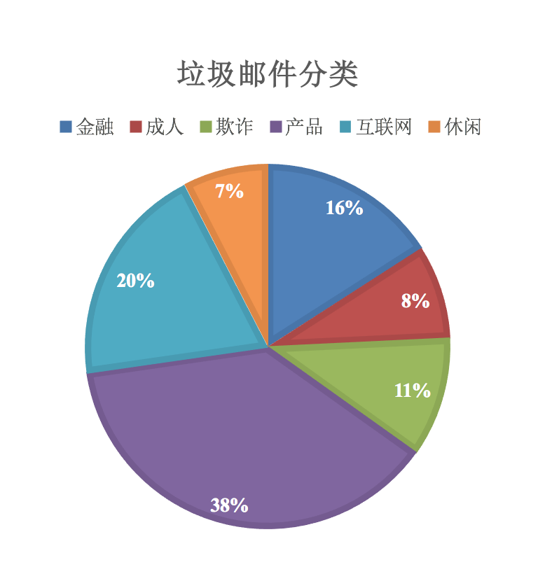
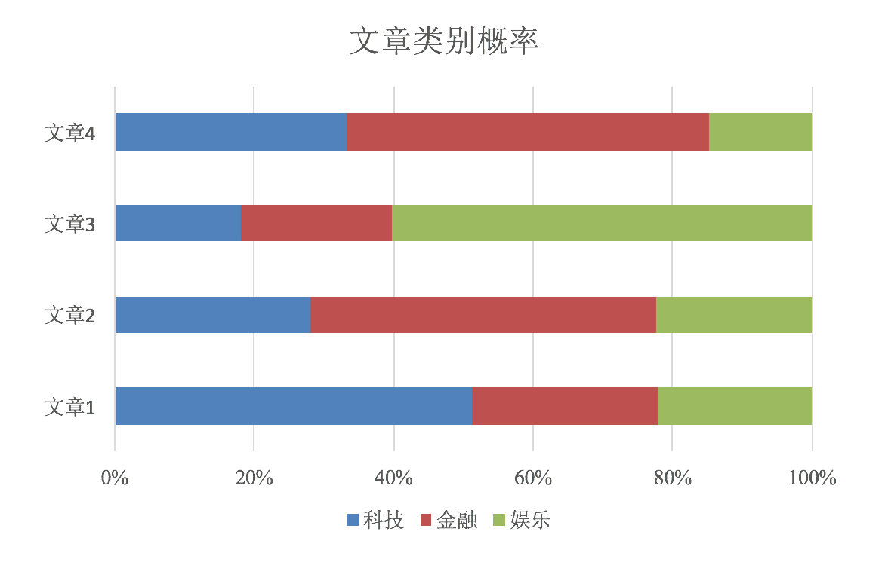
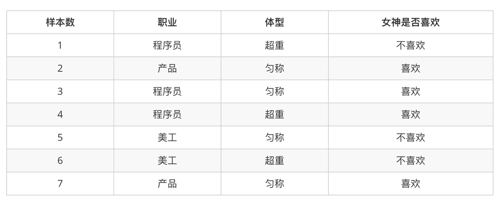
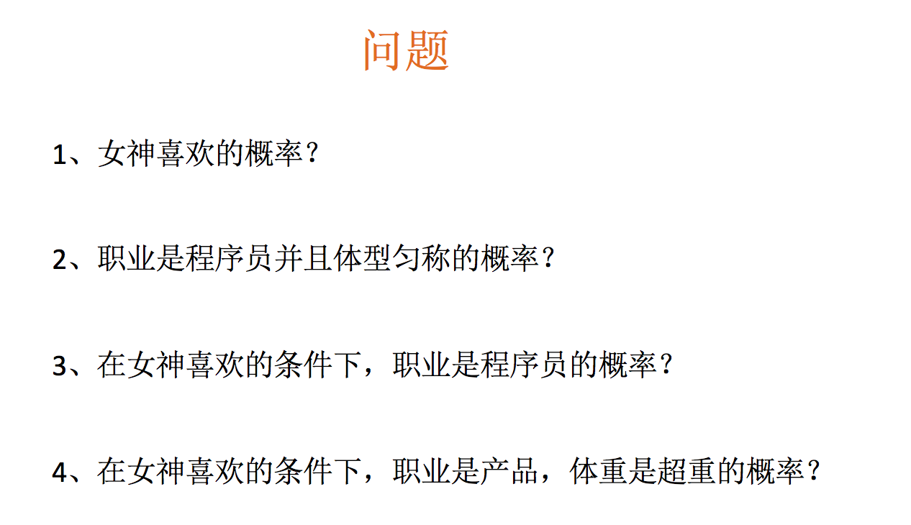
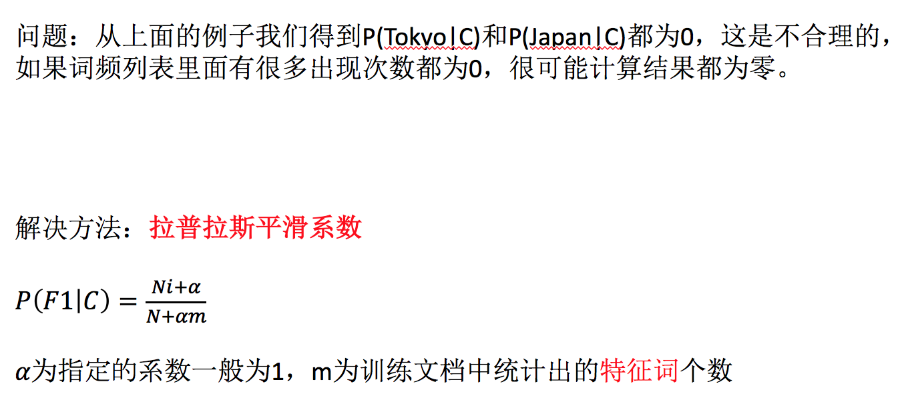
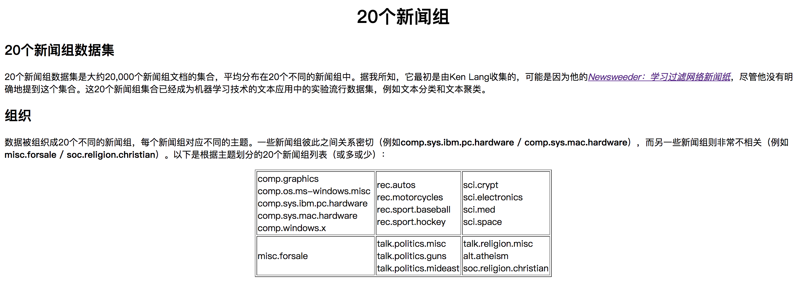

# 3.4. 朴素贝叶斯算法

学习目标
----

*   目标
    *   说明条件概率与联合概率
    *   说明贝叶斯公式、以及特征独立的关系
    *   记忆贝叶斯公式
    *   知道拉普拉斯平滑系数
    *   应用贝叶斯公式实现概率的计算
*   应用
    *   20类新闻文章分类预测
*   内容预览
    *   3.4.1 什么是朴素贝叶斯分类方法
    *   3.4.2 概率基础
    *   3.4.3 联合概率、条件概率与相互独立
    *   3.4.4 贝叶斯公式
    *   3.4.5 API
    *   3.4.6 案例：20类新闻分类
    *   3.4.7 朴素贝叶斯算法总结
    *   3.4.8 总结

3.4.1 什么是朴素贝叶斯分类方法
------------------

3.4.2 概率基础
----------

### 1 概率(Probability)定义

*   概率定义为一件事情发生的可能性
    *   扔出一个硬币，结果头像朝上
*   P(X) : 取值在\[0, 1\]

### 2 女神是否喜欢计算案例

在讲这两个概率之前我们通过一个例子，来计算一些结果：

*   问题如下：

计算结果为：

    P(喜欢) = 4/7
    P(程序员, 匀称) = 1/7
    P(程序员|喜欢) = 2/4 = 1/2
    P(程序员, 超重|喜欢) = 1/4

思考题：在小明是产品经理并且体重超重的情况下，如何计算小明被女神喜欢的概率？

即P(喜欢|产品, 超重) = ？

3.4.3 联合概率、条件概率与相互独立
--------------------

*   联合概率：包含多个条件，且所有条件同时成立的概率
    *   记作：P(A,B)
*   条件概率：就是事件A在另外一个事件B已经发生条件下的发生概率
    *   记作：P(A|B)
*   相互独立：如果P(A, B) = P(A)P(B)，则称事件A与事件B相互独立。

3.4.4 贝叶斯公式
-----------

### 1 公式

### 2 计算案例

那么思考题就可以套用贝叶斯公式这样来解决：

    P(喜欢|产品, 超重) = P(产品, 超重|喜欢)P(喜欢)/P(产品, 超重)

上式中，P(产品, 超重|喜欢)和P(产品, 超重)的结果均为0，导致无法计算结果。这是因为我们的样本量太少了，不具有代表性，本来现实生活中，肯定是存在职业是产品经理并且体重超重的人的，P(产品, 超重)不可能为0；而且事件“职业是产品经理”和事件“体重超重”通常被认为是相互独立的事件，但是，根据我们有限的7个样本计算“P(产品, 超重) = P(产品)P(超重)”不成立。

而朴素贝叶斯可以帮助我们解决这个问题。

朴素贝叶斯，简单理解，就是假定了特征与特征之间相互独立的贝叶斯公式。

也就是说，朴素贝叶斯，之所以朴素，就在于假定了特征与特征相互独立。

所以，思考题如果按照朴素贝叶斯的思路来解决，就可以是

    P(产品, 超重) = P(产品) * P(超重) = 2/7 * 3/7 = 6/49
    p(产品, 超重|喜欢) = P(产品|喜欢) * P(超重|喜欢) = 1/2 * 1/4 = 1/8
    P(喜欢|产品, 超重) = P(产品, 超重|喜欢)P(喜欢)/P(产品, 超重) = 1/8 * 4/7 / 6/49 = 7/12

那么这个公式如果应用在文章分类的场景当中，我们可以这样看：

公式分为三个部分：

*   P(C)：每个文档类别的概率(某文档类别数／总文档数量)
*   P(W│C)：给定类别下特征（被预测文档中出现的词）的概率
    *   计算方法：P(F1│C)=Ni/N （训练文档中去计算）
        *   Ni为该F1词在C类别所有文档中出现的次数
        *   N为所属类别C下的文档所有词出现的次数和
*   P(F1,F2,…) 预测文档中每个词的概率

如果计算两个类别概率比较：

**所以我们只要比较前面的大小就可以，得出谁的概率大**

### 3 文章分类计算

* 计算结果

  P(C|Chinese, Chinese, Chinese, Tokyo, Japan) --> P(Chinese, Chinese, Chinese, Tokyo, Japan|C) * P(C) = P(Chinese|C)^3 * P(Tokyo|C) * P(Japan|C) * P(C)
  P(Chinese|C) = 5/8
  P(Tokyo|C) = 0
  P(Japan|C) = 0

3.4.5 API
---------

*   sklearn.naive_bayes.MultinomialNB(alpha = 1.0)
    *   朴素贝叶斯分类
    *   alpha：拉普拉斯平滑系数

3.4.6 案例：20类新闻分类
----------------

### 1 步骤分析

*   进行数据集的分割
*   TFIDF进行的特征抽取
    *   将文章字符串进行单词抽取
*   朴素贝叶斯预测

### 2 代码

* 进行数据集的分割

  # 获取新闻的数据，20个类别
  news = fetch_20newsgroups(subset='all')

  # 进行数据集分割
  x_train, x_test, y_train, y_test = train_test_split(news.data, news.target, test_size=0.3)

* TFIDF进行的特征抽取
  *   将文章字符串进行单词抽取

  # 对于文本数据，进行特征抽取
  tf = TfidfVectorizer()

  x_train = tf.fit_transform(x_train)
  # 这里打印出来的列表是：训练集当中的所有不同词的组成的一个列表
  print(tf.get_feature_names())

  # 不能调用fit_transform
  x_test = tf.transform(x_test)

* 朴素贝叶斯预测

  # estimator估计器流程
  mlb = MultinomialNB(alpha=1.0)

  mlb.fit(x_train, y_train)

  # 进行预测
  y_predict = mlb.predict(x_test)

  print("预测每篇文章的类别：", y_predict[:100])
  print("真实类别为：", y_test[:100])

  print("预测准确率为：", mlb.score(x_test, y_test))

3.4.7 朴素贝叶斯算法总结
---------------

*   优点：
    *   朴素贝叶斯模型发源于古典数学理论，有稳定的分类效率。
    *   对缺失数据不太敏感，算法也比较简单，常用于文本分类。
    *   分类准确度高，速度快
*   缺点：
    *   由于使用了样本属性独立性的假设，所以如果特征属性有关联时其效果不好

3.4.8 总结
--------

*   条件概率、联合概率计算方式与特征独立的关系
*   贝叶斯公式的计算