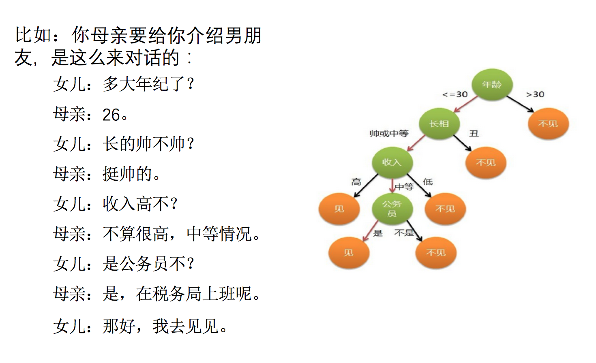

# 3.5. 决策树

学习目标
----

*   目标
    *   说明信息熵的公式以及作用
    *   说明信息增益的公式作用
    *   应用信息增益实现计算特征的不确定性减少程度
    *   了解决策树的三种算法实现
*   应用
    *   泰坦尼克号乘客生存预测
*   内容预览
    *   3.5.1 认识决策树
    *   3.5.2 决策树分类原理详解
    *   3.5.3 决策树API
    *   3.5.4 案例：泰坦尼克号乘客生存预测
    *   3.5.5 决策树可视化
    *   3.5.6 决策树总结
    *   3.5.7 总结

3.5.1 认识决策树
-----------

决策树思想的来源非常朴素，程序设计中的条件分支结构就是if-else结构，最早的决策树就是利用这类结构分割数据的一种分类学习方法

怎么理解这句话？通过一个对话例子

想一想这个女生为什么把年龄放在最上面判断！！！！！！！！！

3.5.2 决策树分类原理详解
---------------

为了更好理解决策树具体怎么分类的，我们通过一个问题例子？

#### 问题：如何对这些客户进行分类预测？你是如何去划分？

有可能你的划分是这样的

那么我们怎么知道这些特征哪个更好放在最上面，那么决策树的真是划分是这样的

### 1 原理

*   信息熵、信息增益等

**需要用到信息论的知识！！！问题：通过例子引入信息熵**

### 2 信息熵的定义

*   H的专业术语称之为信息熵，单位为比特。

H(X)=−∑i=1nP(xi)logbP(xi)) H(X)=-\\sum_{i=1}^{n}P(x\_i)log\_bP(x_i)) H(X)=−i=1∑nP(xi)logbP(xi))

### 3 决策树的划分依据之一------信息增益

*   定义与公式

特征A对训练数据集D的信息增益g(D,A),定义为集合D的信息熵H(D)与特征A给定条件下D的信息条件熵H(D|A)之差，即公式为：

公式的详细解释：

> 注：信息增益表示得知特征X的信息而息的不确定性减少的程度使得类Y的信息熵减少的程度

*   贷款特征重要计算

* 我们以年龄特征来计算：

  1、g(D, 年龄) = H(D) -H(D|年龄) = 0.971-[5/15H(青年)+5/15H(中年)+5/15H(老年]

  2、H(D) = -(6/15log(6/15)+9/15log(9/15))=0.971

  3、H(青年) = -(3/5log(3/5) +2/5log(2/5))
  H(中年)=-(3/5log(3/5) +2/5log(2/5))
  H(老年)=-(4/5og(4/5)+1/5log(1/5))

我们以A1、A2、A3、A4代表年龄、有工作、有自己的房子和贷款情况。最终计算的结果g(D, A1) = 0.313, g(D, A2) = 0.324, g(D, A3) = 0.420,g(D, A4) = 0.363。所以我们选择A3 作为划分的第一个特征。这样我们就可以一棵树慢慢建立

### 4 决策树的划分依据之一------信息增益

当然决策树的原理不止信息增益这一种，还有其他方法。但是原理都类似，我们就不去举例计算。

*   ID3
    *   信息增益 最大的准则
*   C4.5
    *   信息增益比 最大的准则
*   CART
    *   分类树: 基尼系数 最小的准则 在sklearn中可以选择划分的默认原则
    *   优势：划分更加细致（从后面例子的树显示来理解）

3.5.3 决策树API
------------

*   class sklearn.tree.DecisionTreeClassifier(criterion=’gini’, max\_depth=None,random\_state=None)
    *   决策树分类器
    *   criterion:默认是’gini’系数，也可以选择信息增益的熵’entropy’
    *   max_depth:树的深度大小
    *   random_state:随机数种子

3.5.4 案例：泰坦尼克号乘客生存预测
--------------------

*   泰坦尼克号数据

在泰坦尼克号和titanic2数据帧描述泰坦尼克号上的个别乘客的生存状态。这里使用的数据集是由各种研究人员开始的。其中包括许多研究人员创建的旅客名单，由Michael A. Findlay编辑。我们提取的数据集中的特征是票的类别，存活，乘坐班，年龄，登陆，home.dest，房间，票，船和性别。

**1 乘坐班是指乘客班（1，2，3），是社会经济阶层的代表。**

**2 其中age数据存在缺失。**

> 数据：[http://biostat.mc.vanderbilt.edu/wiki/pub/Main/DataSets/titanic.txt](http://biostat.mc.vanderbilt.edu/wiki/pub/Main/DataSets/titanic.txt)

### 分析步骤

* 选择重要的若干个特征，例如 \['pclass', 'age', 'sex'\]

  # 1、获取数据
  titan = pd.read_csv("http://biostat.mc.vanderbilt.edu/wiki/pub/Main/DataSets/titanic.txt")

  # 2、数据的处理
  x = titan[['pclass', 'age', 'sex']]

  y = titan['survived']

* 使用fillna填充缺失值

  # 缺失值需要处理，将特征当中有类别的这些特征进行字典特征抽取
  x['age'].fillna(x['age'].mean(), inplace=True)

* 特征中出现类别符号，需要进行one-hot编码处理(DictVectorizer)
  *   x.to_dict(orient="records") 需要将数组特征转换成字典数据

  # 对于x转换成字典数据x.to_dict(orient="records")
  # [{"pclass": "1st", "age": 29.00, "sex": "female"}, {}]

  dict = DictVectorizer(sparse=False)

  x = dict.fit_transform(x.to_dict(orient="records"))

  print(dict.get_feature_names())
  print(x)

* 数据集划分

   # 分割训练集合测试集
   x_train, x_test, y_train, y_test = train_test_split(x, y, test_size=0.3)

* 决策树分类预测

决策树API当中，如果没有指定max_depth那么会根据信息熵的条件直到最终结束。这里我们可以指定树的深度来进行限制树的大小

    # 进行决策树的建立和预测
    # 指定树的深度大小为5
    dc = DecisionTreeClassifier(criterion='entropy', max_depth=5)
    
    dc.fit(x_train, y_train)
    
    print("预测的准确率为：", dc.score(x_test, y_test))

决策树的结构是可以直接显示的，所以

3.5.5 决策树可视化
------------

### 1 保存树的结构到dot文件

* sklearn.tree.export_graphviz() 该函数能够导出DOT格式
  *   tree.export\_graphviz(estimator,out\_file='tree.dot’,feature_names=\[‘’,’’\])

  export_graphviz(dc, out_file="./tree.dot", feature_names=['age', 'pclass=1st', 'pclass=2nd', 'pclass=3rd', '女性', '男性'])

dot文件当中的内容如下

    digraph Tree {
    node [shape=box] ;
    0 [label="petal length (cm) <= 2.45\nentropy = 1.584\nsamples = 112\nvalue = [39, 37, 36]"] ;
    1 [label="entropy = 0.0\nsamples = 39\nvalue = [39, 0, 0]"] ;
    0 -> 1 [labeldistance=2.5, labelangle=45, headlabel="True"] ;
    2 [label="petal width (cm) <= 1.75\nentropy = 1.0\nsamples = 73\nvalue = [0, 37, 36]"] ;
    0 -> 2 [labeldistance=2.5, labelangle=-45, headlabel="False"] ;
    3 [label="petal length (cm) <= 5.05\nentropy = 0.391\nsamples = 39\nvalue = [0, 36, 3]"] ;
    2 -> 3 ;
    4 [label="sepal length (cm) <= 4.95\nentropy = 0.183\nsamples = 36\nvalue = [0, 35, 1]"] ;
    3 -> 4 ;
    5 [label="petal length (cm) <= 3.9\nentropy = 1.0\nsamples = 2\nvalue = [0, 1, 1]"] ;
    4 -> 5 ;
    6 [label="entropy = 0.0\nsamples = 1\nvalue = [0, 1, 0]"] ;
    5 -> 6 ;
    7 [label="entropy = 0.0\nsamples = 1\nvalue = [0, 0, 1]"] ;
    5 -> 7 ;
    8 [label="entropy = 0.0\nsamples = 34\nvalue = [0, 34, 0]"] ;
    4 -> 8 ;
    9 [label="petal width (cm) <= 1.55\nentropy = 0.918\nsamples = 3\nvalue = [0, 1, 2]"] ;
    3 -> 9 ;
    10 [label="entropy = 0.0\nsamples = 2\nvalue = [0, 0, 2]"] ;
    9 -> 10 ;
    11 [label="entropy = 0.0\nsamples = 1\nvalue = [0, 1, 0]"] ;
    9 -> 11 ;
    12 [label="petal length (cm) <= 4.85\nentropy = 0.191\nsamples = 34\nvalue = [0, 1, 33]"] ;
    2 -> 12 ;
    13 [label="entropy = 0.0\nsamples = 1\nvalue = [0, 1, 0]"] ;
    12 -> 13 ;
    14 [label="entropy = 0.0\nsamples = 33\nvalue = [0, 0, 33]"] ;
    12 -> 14 ;
    }

那么这个结构不能看清结构，所以可以在一个网站上显示

### 2 网站显示结构

*   [http://webgraphviz.com/](http://webgraphviz.com/)

将dot文件内容复制到该网站当中显示

3.5.6 决策树总结
-----------

*   优点：
    *   简单的理解和解释，树木可视化。
*   缺点：
    *   **决策树学习者可以创建不能很好地推广数据的过于复杂的树，这被称为过拟合。**
*   改进：
    *   减枝cart算法(决策树API当中已经实现，随机森林参数调优有相关介绍)
    *   **随机森林**

**注：企业重要决策，由于决策树很好的分析能力，在决策过程应用较多， 可以选择特征**

3.5.7 总结
--------

*   信息熵、信息增益的计算
*   DecisionTreeClassifier进行决策树的划分
*   export_graphviz导出到dot文件