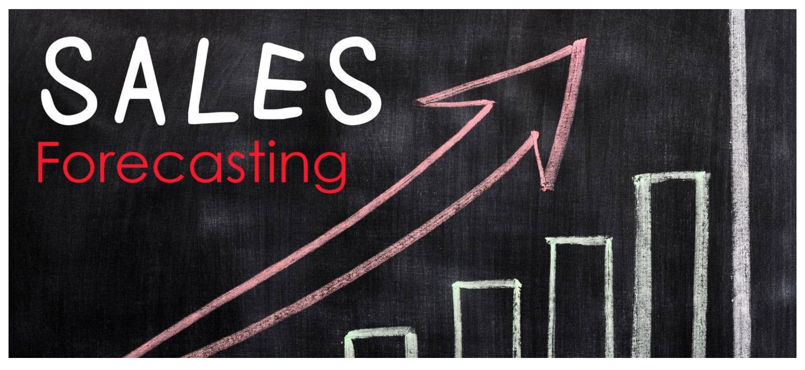
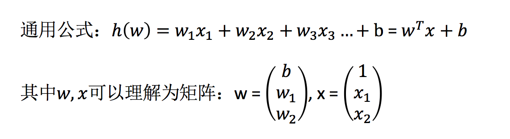
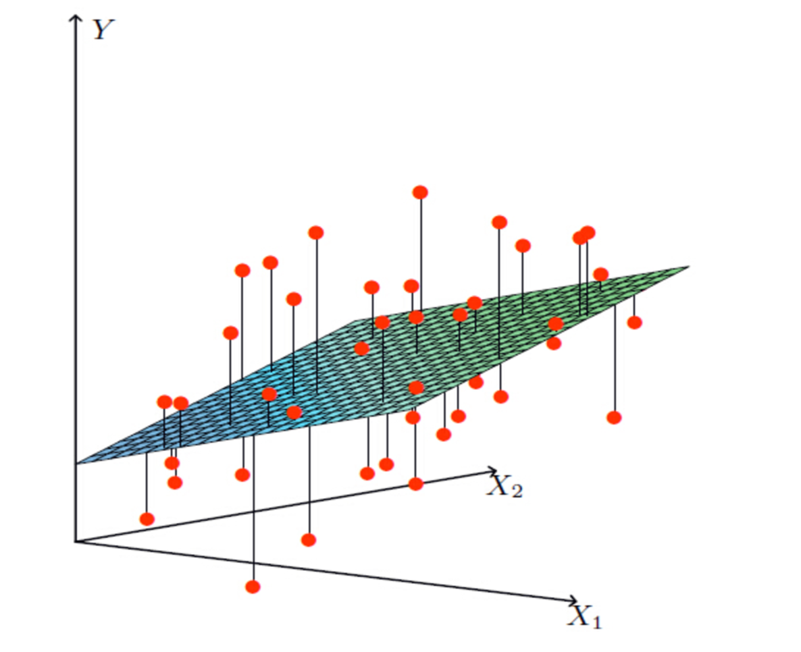
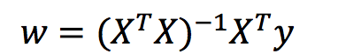
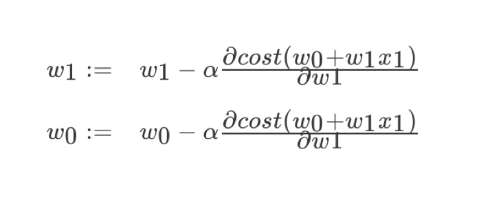
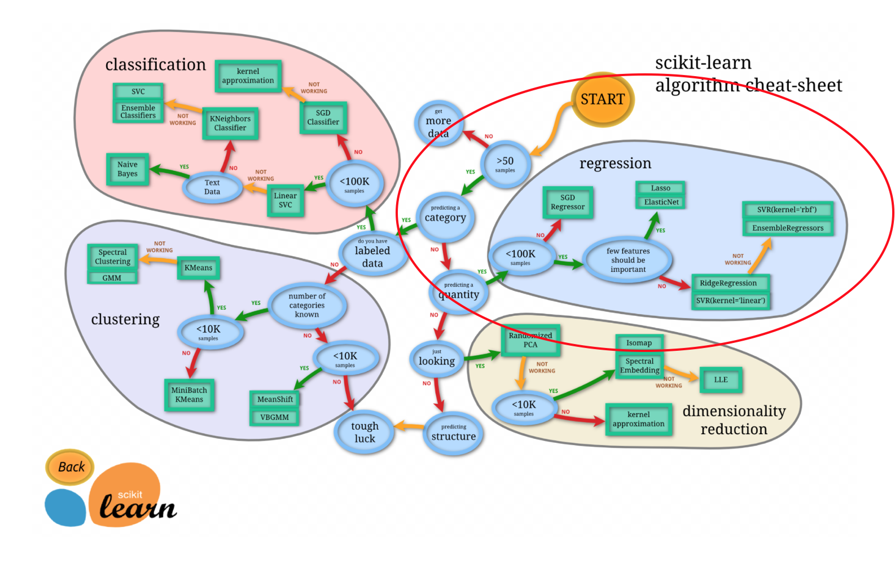

# 4.1. 线性回归

学习目标
----

*   目标
    *   记忆线性回归的原理过程
    *   应用LinearRegression或SGDRegressor实现回归预测
    *   记忆回归算法的评估标准及其公式
*   应用
    *   波士顿房价预测
*   内容预览
    *   4.1.1 线性回归的原理
    *   4.1.2 线性回归的损失和优化原理（理解记忆）
    *   4.1.3 线性回归API
    *   4.1.4 波士顿房价预测

#### 回忆一下回归问题的判定是什么？

4.1.1 线性回归的原理
-------------

### 1 线性回归应用场景

*   房价预测
*   销售额度预测
*   金融：贷款额度预测、利用线性回归以及系数分析因子

### 2 什么是线性回归

#### 1）定义与公式

线性回归(Linear regression)是利用**回归方程(函数)**对一个或**多个自变量(特征值)和因变量(目标值)之间**关系进行建模的一种分析方式。

*   特点：只有一个自变量的情况称为单变量回归，多于一个自变量情况的叫做多元回归

那么怎么理解呢？我们来看几个例子

*   **期末成绩：0.7×考试成绩+0.3×平时成绩**
*   **房子价格 = 0.02×中心区域的距离 + 0.04×城市一氧化氮浓度 + (-0.12×自住房平均房价) + 0.254×城镇犯罪率**

上面两个例子，**我们看到特征值与目标值之间建立了一个关系，这个关系可以理解为线性模型**。

*   模型

#### 2） 线性回归的特征与目标的关系分析

线性回归当中线性模型有两种，一种是线性关系，另一种是非线性关系。**在这里我们只能画一个平面更好去理解，所以都用单个特征或两个特征举例子。**

*   线性关系 

> 注释：单特征与目标值的关系呈直线关系，或者两个特征与目标值呈现平面的关系
>
> 更高维度的我们不用自己去想，记住这种关系即可

*   非线性关系

> 注释：为什么会这样的关系呢？原因是什么？
>
> 如果是非线性关系，那么回归方程可以理解为：w1x1+w2x2^2+w3x3^2

4.1.2 线性回归的损失和优化原理（理解记忆）
------------------------

**假设刚才的房子例子，真实的数据之间存在这样的关系**

    真实关系：真实房子价格 = 0.02×中心区域的距离 + 0.04×城市一氧化氮浓度 + (-0.12×自住房平均房价) + 0.254×城镇犯罪率

那么现在呢，我们随意指定一个关系（猜测）

    随机指定关系：预测房子价格 = 0.25×中心区域的距离 + 0.14×城市一氧化氮浓度 + 0.42×自住房平均房价 + 0.34×城镇犯罪率

请问这样的话，会发生什么？真实结果与我们预测的结果之间是不是存在一定的误差呢？类似这样样子

既然存在这个误差，那我们就将这个误差给衡量出来

### 1 损失函数

总损失定义为：

*   y_i为第i个训练样本的真实值
*   h(x_i)为第i个训练样本特征值组合预测函数
*   又称最小二乘法

**如何去减少这个损失，使我们预测的更加准确些？既然存在了这个损失，我们一直说机器学习有自动学习的功能，在线性回归这里更是能够体现。这里可以通过一些优化方法去优化（其实是数学当中的求导功能）回归的总损失！！！**

### 2 优化算法

**如何去求模型当中的W，使得损失最小？（目的是找到最小损失对应的W值）**

线性回归经常使用的两种优化算法

*   正规方程

> 理解：X为特征值矩阵，y为目标值矩阵。直接求到最好的结果
>
> 缺点：当特征过多过复杂时，求解速度太慢并且得不到结果

*   **梯度下降(Gradient Descent)**

> 理解：α为学习速率，需要手动指定（超参数），α旁边的整体表示方向
>
> 沿着这个函数下降的方向找，最后就能找到山谷的最低点，然后更新W值
>
> 使用：面对训练数据规模十分庞大的任务 ，能够找到较好的结果

我们通过两个图更好理解梯度下降的过程

**所以有了梯度下降这样一个优化算法，回归就有了"自动学习"的能力**

### 3 优化动态图演示

4.1.3 线性回归API
-------------

*   sklearn.linear\_model.LinearRegression(fit\_intercept=True)
    *   通过正规方程优化
    *   fit_intercept：是否计算偏置
    *   LinearRegression.coef_：回归系数
    *   LinearRegression.intercept_：偏置
*   sklearn.linear\_model.SGDRegressor(loss="squared\_loss", fit\_intercept=True, learning\_rate ='invscaling', eta0=0.01)
    *   SGDRegressor类实现了随机梯度下降学习，它支持不同的**loss函数和正则化惩罚项**来拟合线性回归模型。
    *   loss:损失类型
        *   **loss=”squared_loss”: 普通最小二乘法**
    *   fit_intercept：是否计算偏置
    *   learning_rate : string, optional
        *   学习率填充
        *   **'constant': eta = eta0**
        *   **'optimal': eta = 1.0 / (alpha * (t + t0)) \[default\]**
        *   **'invscaling': eta = eta0 / pow(t, power_t)**
            *   **power_t=0.25:存在父类当中**
        *   **对于一个常数值的学习率来说，可以使用learning_rate=’constant’ ，并使用eta0来指定学习率。**
    *   SGDRegressor.coef_：回归系数
    *   SGDRegressor.intercept_：偏置

> sklearn提供给我们两种实现的API， 可以根据选择使用

4.1.4 波士顿房价预测
-------------

*   数据介绍

> 给定的这些特征，是专家们得出的影响房价的结果属性。我们此阶段不需要自己去探究特征是否有用，只需要使用这些特征。到后面量化很多特征需要我们自己去寻找

### 1 分析

回归当中的数据大小不一致，是否会导致结果影响较大。所以需要做标准化处理。

*   数据分割与标准化处理
*   回归预测
*   线性回归的算法效果评估

### 2 回归性能评估

均方误差(Mean Squared Error)MSE)评价机制：

> 注：y^i为预测值，¯y为真实值

*   sklearn.metrics.mean\_squared\_error(y\_true, y\_pred)
    *   均方误差回归损失
    *   y_true:真实值
    *   y_pred:预测值
    *   return:浮点数结果

### 3 代码

    def linear1():
        """
        用正规方程直接求出模型参数的方法进行对波士顿房价预测的线性回归案例
        :return: None
        """
        # 1、获取数据集
        boston = load_boston()
        print("boston:\n", boston.DESCR)
        # 2、划分数据集
        x_train, x_test, y_train, y_test = train_test_split(boston.data, boston.target, random_state=6)
        # 3、特征工程：标准化
        # 1）实例化一个转换器类
        transfer = StandardScaler()
        # 2）调用fit_transform
        x_train = transfer.fit_transform(x_train)
        x_test = transfer.transform(x_test)
        # 4、线性回归的预估器流程
        estimator = LinearRegression()
        estimator.fit(x_train, y_train)
        y_predict = estimator.predict(x_test)
        print("正规方程求出模型参数的方法预测的房屋价格为：\n", y_predict)
        # 5、得出模型
        print("正规方程求出的回归系数为：\n", estimator.coef_)
        print("正规方程求出的偏置为：\n", estimator.intercept_)
        # 6、模型评估——均方误差
        error = mean_squared_error(y_test, y_predict)
        print("正规方程的均方误差为：\n", error)
        return None

​    
    def linear2():
        """
        用梯度下降优化模型参数的方法进行对波士顿房价预测的线性回归案例
        :return: None
        """
        # 1、获取数据集
        boston = load_boston()
        # print("boston:\n", boston)
        # 2、划分数据集
        x_train, x_test, y_train, y_test = train_test_split(boston.data, boston.target, random_state=6)
        # 3、特征工程：标准化
        # 1）实例化一个转换器类
        transfer = StandardScaler()
        # 2）调用fit_transform
        x_train = transfer.fit_transform(x_train)
        x_test = transfer.transform(x_test)
        # 4、线性回归的预估器流程
        estimator = SGDRegressor()
        estimator.fit(x_train, y_train)
        y_predict = estimator.predict(x_test)
        print("梯度下降求出模型参数的方法预测的房屋价格为：\n", y_predict)
        # 5、得出模型
        print("梯度下降求出的回归系数为：\n", estimator.coef_)
        print("梯度下降求出的偏置为：\n", estimator.intercept_)
        # 6、模型评估——均方误差
        error = mean_squared_error(y_test, y_predict)
        print("梯度下降的均方误差为：\n", error)
        return None

我们也可以尝试去修改学习率

    estimator = SGDRegressor(learning_rate='constant', eta0=0.001)

此时我们可以通过调参数，找到学习率效果更好的值。

### 4 正规方程和梯度下降对比

*   文字对比

梯度下降

正规方程

需要选择学习率

不需要

需要迭代求解

一次运算得出

特征数量较大可以使用

需要计算方程，时间复杂度高O(n3)

*   选择：
    *   小规模数据：
        *   **LinearRegression(不能解决拟合问题)**
        *   岭回归
    *   大规模数据：SGDRegressor

> 4.1.5 拓展-关于优化方法GD、SGD、SAG
>
> 1 GD
>
> **梯度下降(Gradient Descent)，原始的梯度下降法需要计算所有样本的值才能够得出梯度，计算量大，所以后面才有会一系列的改进。**
>
> 2 SGD
>
> **随机梯度下降(Stochastic gradient descent)是一个优化方法。它在一次迭代时只考虑一个训练样本。**
>
> *   SGD的优点是：
>     *   高效
>     *   容易实现
> *   SGD的缺点是：
>     *   SGD需要许多超参数：比如正则项参数、迭代数。
>     *   SGD对于特征标准化是敏感的。
>
> 3 SAG
>
> 随机平均梯度法(Stochasitc Average Gradient)，由于收敛的速度太慢，有人提出SAG等基于梯度下降的算法
>
> Scikit-learn：岭回归、逻辑回归等当中都会有SAG优化

4.1.6 总结
--------

*   线性回归的损失函数-均方误差
*   线性回归的优化方法
    *   正规方程
    *   梯度下降
*   线性回归的性能衡量方法-均方误差
*   sklearn的SGDRegressor API 参数