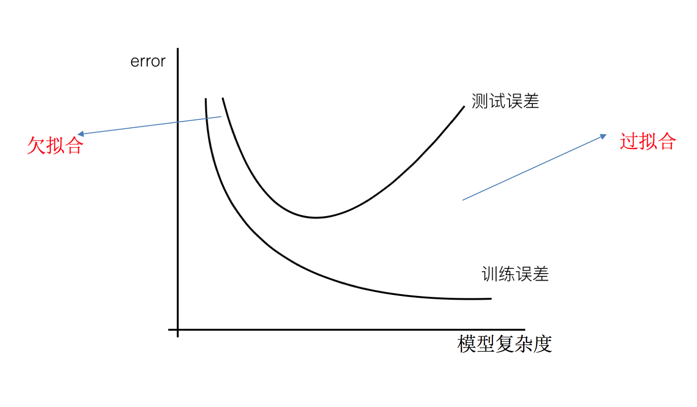
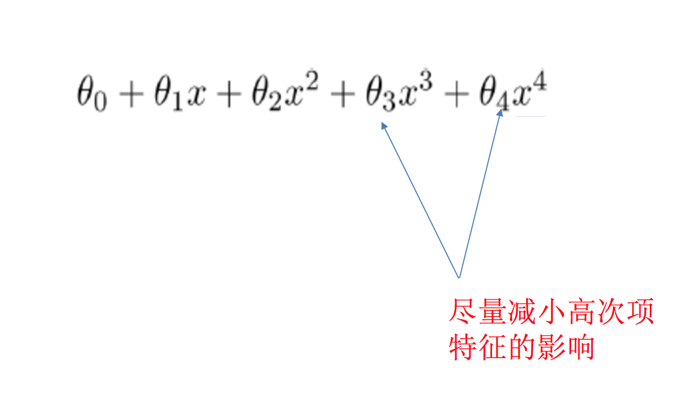

# 4.2. 欠拟合与过拟合

学习目标
----

*   目标
    *   说明线性回归（不带正则化）的缺点
    *   说明过拟合与欠拟合的原因以及解决方法
*   应用
    *   无
*   内容预览
    *   4.2.1 什么是过拟合与欠拟合
    *   4.2.2 原因以及解决办法

### 问题：训练数据训练的很好啊，误差也不大，为什么在测试集上面有问题呢？

当算法在某个数据集当中出现这种情况，可能就出现了过拟合现象。

4.2.1 什么是过拟合与欠拟合
----------------

*   欠拟合

*   过拟合

*   分析
    *   第一种情况：因为机器学习到的天鹅特征太少了，导致区分标准太粗糙，不能准确识别出天鹅。
    *   第二种情况：机器已经基本能区别天鹅和其他动物了。然后，很不巧已有的天鹅图片全是白天鹅的，于是机器经过学习后，会认为天鹅的羽毛都是白的，以后看到羽毛是黑的天鹅就会认为那不是天鹅。

### 定义

*   过拟合：一个假设在训练数据上能够获得比其他假设更好的拟合， 但是在测试数据集上却不能很好地拟合数据，此时认为这个假设出现了过拟合的现象。(模型过于复杂)
*   欠拟合：一个假设在训练数据上不能获得更好的拟合，并且在测试数据集上也不能很好地拟合数据，此时认为这个假设出现了欠拟合的现象。(模型过于简单)

#### 那么是什么原因导致模型复杂？线性回归进行训练学习的时候变成模型会变得复杂，这里就对应前面再说的线性回归的两种关系，非线性关系的数据，也就是存在很多无用的特征或者现实中的事物特征跟目标值的关系并不是简单的线性关系。

4.2.2 原因以及解决办法
--------------

*   欠拟合原因以及解决办法
    *   原因：学习到数据的特征过少
    *   解决办法：增加数据的特征数量
*   过拟合原因以及解决办法
    *   原因：原始特征过多，存在一些嘈杂特征， 模型过于复杂是因为模型尝试去兼顾各个测试数据点
    *   解决办法：
        *   正则化

> 在这里针对回归，我们选择了正则化。但是对于其他机器学习算法如分类算法来说也会出现这样的问题，除了一些算法本身作用之外（决策树、神经网络），我们更多的也是去自己做特征选择，包括之前说的删除、合并一些特征

#### 如何解决？

> 在学习的时候，数据提供的特征有些影响模型复杂度或者这个特征的数据点异常较多，所以算法在学习的时候尽量减少这个特征的影响（甚至删除某个特征的影响），这就是正则化
>
> 注：调整时候，算法并不知道某个特征影响，而是去调整参数得出优化的结果

### 1 正则化类别

*   L2正则化
    *   作用：可以使得其中一些W的都很小，都接近于0，削弱某个特征的影响
    *   优点：越小的参数说明模型越简单，越简单的模型则越不容易产生过拟合现象
    *   Ridge回归
*   L1正则化
    *   作用：可以使得其中一些W的值直接为0，删除这个特征的影响
    *   LASSO回归

### 2 拓展-原理(了解)

> 线性回归的损失函数用最小二乘法，等价于当预测值与真实值的误差满足正态分布时的极大似然估计；岭回归的损失函数，是最小二乘法+L2范数，等价于当预测值与真实值的误差满足正态分布，且权重值也满足正态分布（先验分布）时的最大后验估计；LASSO的损失函数，是最小二乘法+L1范数，等价于当预测值与真实值的误差满足正态分布，且权重值满足拉普拉斯分布（先验分布）时的最大后验估计