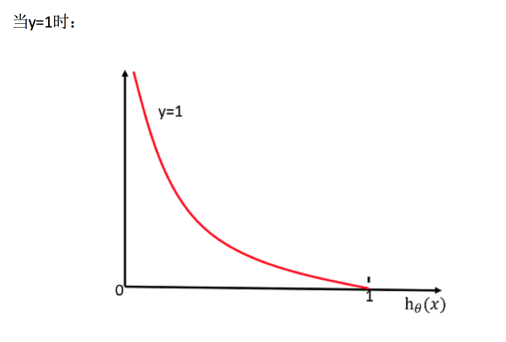
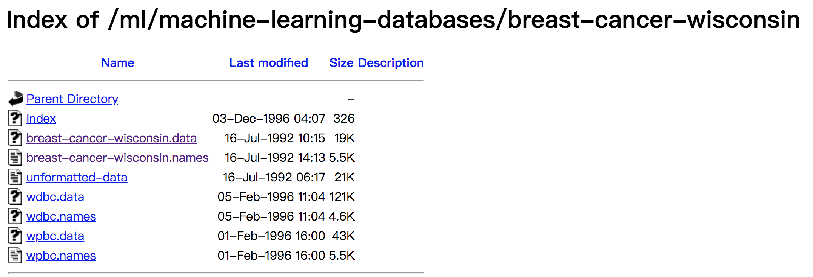
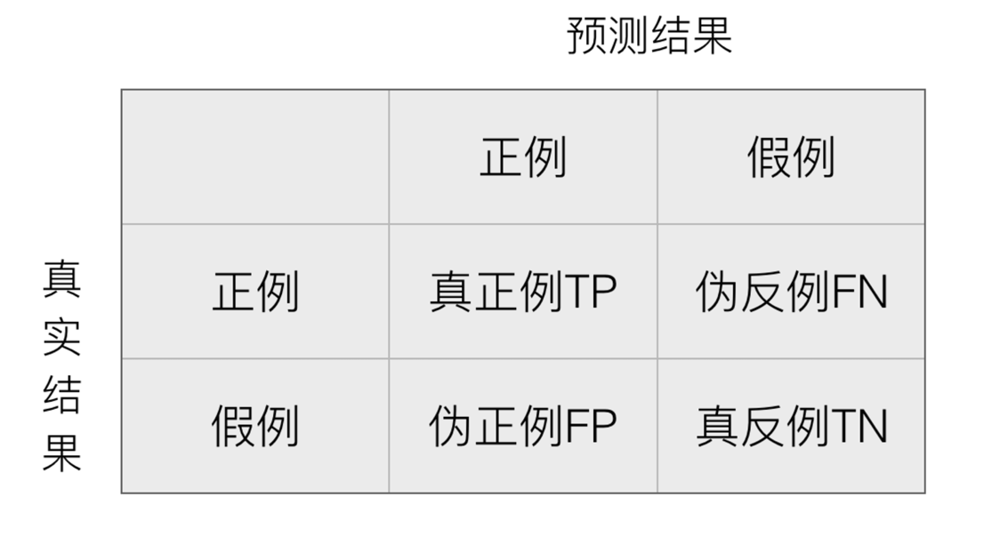

# 4.4. 分类算法-逻辑回归与二分类

学习目标
----

*   目标
    *   说明逻辑回归的损失函数
    *   说明逻辑回归的优化方法
    *   说明sigmoid函数
    *   知道逻辑回归的应用场景
    *   知道精确率、召回率指标的区别
    *   知道F1-score指标说明召回率的实际意义
    *   说明如何解决样本不均衡情况下的评估
    *   了解ROC曲线的意义说明AUC指标大小
    *   应用classification_report实现精确率、召回率计算
    *   应用roc\_auc\_score实现指标计算
*   应用
    *   癌症患者预测
*   内容预览
    *   4.4.1 逻辑回归的应用场景
    *   4.4.2 逻辑回归的原理
    *   4.4.3 逻辑回归API
    *   4.4.4 案例：癌症分类预测-良／恶性乳腺癌肿瘤预测
    *   4.4.5 分类的评估方法

逻辑回归（Logistic Regression）是机器学习中的一种分类模型，逻辑回归是一种分类算法，虽然名字中带有回归，但是它与回归之间有一定的联系。由于算法的简单和高效，在实际中应用非常广泛。

4.4.1 逻辑回归的应用场景
---------------

*   广告点击率
*   是否为垃圾邮件
*   是否患病
*   金融诈骗
*   虚假账号

看到上面的例子，我们可以发现其中的特点，那就是都属于两个类别之间的判断。逻辑回归就是解决二分类问题的利器

4.4.2 逻辑回归的原理
-------------

### 1 输入

逻辑回归的输入就是一个线性回归的结果。

### 2 激活函数

*   sigmoid函数

*   分析
    *   回归的结果输入到sigmoid函数当中
    *   输出结果：\[0, 1\]区间中的一个概率值，默认为0.5为阈值

> 逻辑回归最终的分类是通过属于某个类别的概率值来判断是否属于某个类别，并且这个类别默认标记为1(正例),另外的一个类别会标记为0(反例)。（方便损失计算）

#### 输出结果解释(重要)：假设有两个类别A，B，并且假设我们的概率值为属于A(1)这个类别的概率值。现在有一个样本的输入到逻辑回归输出结果0.6，那么这个概率值超过0.5，意味着我们训练或者预测的结果就是A(1)类别。那么反之，如果得出结果为0.3那么，训练或者预测结果就为B(0)类别。

#### 所以接下来我们回忆之前的线性回归预测结果我们用均方误差衡量，那如果对于逻辑回归，我们预测的结果不对该怎么去衡量这个损失呢？我们来看这样一张图

那么如何去衡量逻辑回归的预测结果与真实结果的差异呢？

### 3 损失以及优化

#### 1 损失

逻辑回归的损失，称之为**对数似然损失**，公式如下：

*   分开类别：

怎么理解单个的式子呢？这个要根据log的函数图像来理解

*   综合完整损失函数

> 看到这个式子，其实跟我们讲的信息熵类似。

接下来我们呢就带入上面那个例子来计算一遍，就能理解意义了。

> 我们已经知道，log(P), P值越大，结果越小，所以我们可以对着这个损失的式子去分析

#### 2 优化

同样使用梯度下降优化算法，去减少损失函数的值。这样去更新逻辑回归前面对应算法的权重参数，**提升原本属于1类别的概率，降低原本是0类别的概率。**

4.4.3 逻辑回归API
-------------

*   sklearn.linear_model.LogisticRegression(solver='liblinear', penalty=‘l2’, C = 1.0)
    *   solver:优化求解方式（默认开源的liblinear库实现，内部使用了坐标轴下降法来迭代优化损失函数）
        *   sag：根据数据集自动选择，随机平均梯度下降
    *   penalty：正则化的种类
    *   C：正则化力度

> **默认将类别数量少的当做正例**

#### LogisticRegression方法相当于 SGDClassifier(loss="log", penalty=" "),SGDClassifier实现了一个普通的随机梯度下降学习，也支持平均随机梯度下降法（ASGD），可以通过设置average=True。而使用LogisticRegression(实现了SAG)

4.4.4 案例：癌症分类预测-良／恶性乳腺癌肿瘤预测
---------------------------

*   数据介绍

原始数据的下载地址：[https://archive.ics.uci.edu/ml/machine-learning-databases/](https://archive.ics.uci.edu/ml/machine-learning-databases/breast-cancer-wisconsin/)

> 数据描述
>
> （1）699条样本，共11列数据，第一列用语检索的id，后9列分别是与肿瘤
>
> 相关的医学特征，最后一列表示肿瘤类型的数值。
>
> （2）包含16个缺失值，用”?”标出。

### 1 分析

*   缺失值处理
*   标准化处理
*   逻辑回归预测

### 2 代码

    def logisticregression():
        """
        逻辑回归进行癌症预测
        :return: None
        """
        # 1、读取数据，处理缺失值以及标准化
        column_name = ['Sample code number', 'Clump Thickness', 'Uniformity of Cell Size', 'Uniformity of Cell Shape',
                       'Marginal Adhesion', 'Single Epithelial Cell Size', 'Bare Nuclei', 'Bland Chromatin',
                       'Normal Nucleoli', 'Mitoses', 'Class']
    
        data = pd.read_csv("https://archive.ics.uci.edu/ml/machine-learning-databases/breast-cancer-wisconsin/breast-cancer-wisconsin.data",
                           names=column_name)
    
        # 删除缺失值
        data = data.replace(to_replace='?', value=np.nan)
    
        data = data.dropna()
    
        # 取出特征值
        x = data[column_name[1:10]]
    
        y = data[column_name[10]]
    
        # 分割数据集
        x_train, x_test, y_train, y_test = train_test_split(x, y, test_size=0.3)
    
        # 进行标准化
        std = StandardScaler()
    
        x_train = std.fit_transform(x_train)
    
        x_test = std.transform(x_test)
    
        # 使用逻辑回归
        lr = LogisticRegression()
    
        lr.fit(x_train, y_train)
    
        print("得出来的权重：", lr.coef_)
    
        # 预测类别
        print("预测的类别：", lr.predict(x_test))
    
        # 得出准确率
        print("预测的准确率:", lr.score(x_test, y_test))
        return None

在很多分类场景当中我们不一定只关注预测的准确率！！！！！

比如以这个癌症举例子！！！我们并不关注预测的准确率，而是关注在所有的样本当中，癌症患者有没有被全部预测（检测）出来。

4.4.5 分类的评估方法
-------------

### 1 精确率与召回率

#### 1 混淆矩阵

在分类任务下，预测结果(Predicted Condition)与正确标记(True Condition)之间存在四种不同的组合，构成混淆矩阵(适用于多分类)

#### 2 精确率(Precision)与召回率(Recall)

*   精确率：预测结果为正例样本中真实为正例的比例（了解）

*   召回率：真实为正例的样本中预测结果为正例的比例（查得全，对正样本的区分能力）

还有其他的评估标准，F1-score，反映了模型的稳健型

#### 3 分类评估报告API

* sklearn.metrics.classification\_report(y\_true, y\_pred, labels=\[\], target\_names=None )
* *   y_true：真实目标值
  *   y_pred：估计器预测目标值
  *   labels:指定类别对应的数字
  *   target_names：目标类别名称
  *   return：每个类别精确率与召回率

  print("精确率和召回率为：", classification_report(y_test, lr.predict(x_test), labels=[2, 4], target_names=['良性', '恶性']))

**假设这样一个情况，如果99个样本癌症，1个样本非癌症，不管怎样我全都预测正例(默认癌症为正例),准确率就为99%但是这样效果并不好，这就是样本不均衡下的评估问题**

#### 问题：如何衡量样本不均衡下的评估？

### 2 ROC曲线与AUC指标

#### 1 知道TPR与FPR

*   TPR = TP / (TP + FN)
    *   所有真实类别为1的样本中，预测类别为1的比例
*   FPR = FP / (FP + TN)
    *   所有真实类别为0的样本中，预测类别为1的比例

#### 2 ROC曲线

*   ROC曲线的横轴就是FPRate，纵轴就是TPRate，当二者相等时，表示的意义则是：对于不论真实类别是1还是0的样本，分类器预测为1的概率是相等的，此时AUC为0.5

#### 3 AUC指标

*   AUC的概率意义是随机取一对正负样本，正样本得分大于负样本的概率
*   AUC的最小值为0.5，最大值为1，取值越高越好
*   **AUC=1，完美分类器，采用这个预测模型时，不管设定什么阈值都能得出完美预测。绝大多数预测的场合，不存在完美分类器。**
*   **0.5<AUC<1，优于随机猜测。这个分类器（模型）妥善设定阈值的话，能有预测价值。**

> **最终AUC的范围在\[0.5, 1\]之间，并且越接近1越好**

#### 4 AUC计算API

* from sklearn.metrics import roc\_auc\_score
  *   sklearn.metrics.roc\_auc\_score(y\_true, y\_score)
      *   计算ROC曲线面积，即AUC值
      *   y_true：每个样本的真实类别，必须为0(反例),1(正例)标记
      *   y_score：预测得分，可以是正类的估计概率、置信值或者分类器方法的返回值

  # 0.5~1之间，越接近于1约好
  y_test = np.where(y_test > 2.5, 1, 0)

  print("AUC指标：", roc_auc_score(y_test, lr.predict(x_test)))

#### 5 总结

*   AUC只能用来评价二分类
*   AUC非常适合评价样本不平衡中的分类器性能