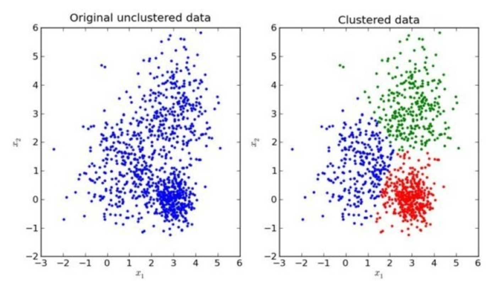

# 4.6. 无监督学习-K-means算法

学习目标
----

*   目标
    *   说明K-means算法原理
    *   说明K-means的性能评估标准轮廓系数
    *   说明K-means的优缺点
*   应用
    *   instacart用户聚类
*   内容预览
    *   4.6.1 什么是无监督学习
    *   4.6.2 无监督学习包含算法
    *   4.6.3 K-means原理
    *   4.6.4 K-meansAPI
    *   4.6.5 案例：k-means对Instacart Market用户聚类
    *   4.6.6 Kmeans性能评估指标

#### 回忆非监督学习的特点？

4.6.1 什么是无监督学习
--------------

*   一家广告平台需要根据相似的人口学特征和购买习惯将美国人口分成不同的小组，以便广告客户可以通过有关联的广告接触到他们的目标客户。
*   Airbnb 需要将自己的房屋清单分组成不同的社区，以便用户能更轻松地查阅这些清单。
*   一个数据科学团队需要降低一个大型数据集的维度的数量，以便简化建模和降低文件大小。

我们可以怎样最有用地对其进行归纳和分组？我们可以怎样以一种压缩格式有效地表征数据？**这都是无监督学习的目标，之所以称之为无监督，是因为这是从无标签的数据开始学习的。**

4.6.2 无监督学习包含算法
---------------

*   聚类
    *   K-means(K均值聚类)
*   降维
    *   PCA

4.6.3 K-means原理
---------------

我们先来看一下一个K-means的聚类效果图

### K-means聚类步骤

*   1、随机设置K个特征空间内的点作为初始的聚类中心
*   2、对于其他每个点计算到K个中心的距离，未知的点选择最近的一个聚类中心点作为标记类别
*   3、接着对着标记的聚类中心之后，重新计算出每个聚类的新中心点（平均值）
*   4、如果计算得出的新中心点与原中心点一样，那么结束，否则重新进行第二步过程

我们以一张图来解释效果

4.6.4 K-meansAPI
----------------

*   sklearn.cluster.KMeans(n_clusters=8,init=‘k-means++’)
    *   k-means聚类
    *   n_clusters:开始的聚类中心数量
    *   init:初始化方法，默认为'k-means ++’
    *   labels_:默认标记的类型，可以和真实值比较（不是值比较）

4.6.5 案例：k-means对Instacart Market用户聚类
-------------------------------------

### 1 分析

*   1、降维之后的数据
*   2、k-means聚类
*   3、聚类结果显示

### 2 代码

    # 取500个用户进行测试
    cust = data[:500]
    km = KMeans(n_clusters=4)
    km.fit(cust)
    pre = km.predict(cust)

#### 问题：如何去评估聚类的效果呢？

4.6.6 Kmeans性能评估指标
------------------

### 1 轮廓系数

> 注：对于每个点i 为已聚类数据中的样本 ，b\_i 为i 到其它族群的所有样本的距离最小值，a\_i 为i 到本身簇的距离平均值。最终计算出所有的样本点的轮廓系数平均值

### 2 轮廓系数值分析

*   分析过程（我们以一个蓝1点为例）

    *   1、计算出蓝1离本身族群所有点的距离的平均值a_i

    *   2、蓝1到其它两个族群的距离计算出平均值红平均，绿平均，取最小的那个距离作为b_i

    *   根据公式：极端值考虑：如果b\_i >>a\_i: 那么公式结果趋近于1；如果a\_i>>>b\_i: 那么公式结果趋近于-1

### 3 结论

**如果b\_i>>a\_i:趋近于1效果越好， b\_i<<a\_i:趋近于-1，效果不好。轮廓系数的值是介于 \[-1,1\] ，越趋近于1代表内聚度和分离度都相对较优。**

### 4 轮廓系数API

*   sklearn.metrics.silhouette_score(X, labels)
    *   计算所有样本的平均轮廓系数
    *   X：特征值
    *   labels：被聚类标记的目标值

### 5 用户聚类结果评估

    silhouette_score(cust, pre)

4.6.7 K-means总结
---------------

*   特点分析：采用迭代式算法，直观易懂并且非常实用
*   缺点：容易收敛到局部最优解(多次聚类)

> 注意：聚类一般做在分类之前